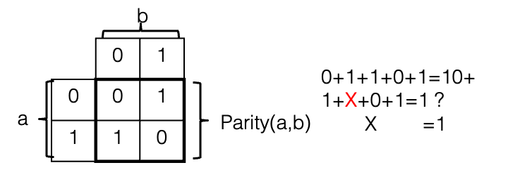

::: {#pst-skip-link .skip-link .d-print-none}
[Skip to main content](#main-content)
:::

::: {#pst-scroll-pixel-helper}
:::

Back to top

::: search-button__wrapper
::: search-button__overlay
:::

::: search-button__search-container
[[Ctrl]{.kbd .kbd-shortcut__modifier}+[K]{.kbd}]{.search-button__kbd-shortcut}
:::
:::

::: {.pst-async-banner-revealer .d-none}
:::

::: {.bd-header .navbar .navbar-expand-lg .bd-navbar .d-print-none}
:::

::: bd-container
::: {.bd-container__inner .bd-page-width}
::: {.bd-sidebar-primary .bd-sidebar}
::: {.sidebar-header-items .sidebar-primary__section}
:::

::: {.sidebar-primary-items__start .sidebar-primary__section}
::: sidebar-primary-item
[{.logo__image .only-light}](../intro/pref.html){.navbar-brand .logo}
:::

::: sidebar-primary-item
:::

::: sidebar-primary-item
::: {.bd-toc-item .navbar-nav .active}
-   [Preface](../intro/pref.html){.reference .internal}

[Getting started]{.caption-text}

-   [1. Introduction](../intro/intro.html){.reference .internal}
-   [2. Purpose of operating systems](../intro/purpose.html){.reference .internal}
-   [3. Operating System Structure & Unix/Linux](../intro/structure.html){.reference .internal}
-   [4. Operating System Abstractions](../intro/abstractions.html){.reference .internal}
-   [5. What you should know](../intro/tools.html){.reference .internal}
    []{.toctree-toggle role="presentation"}
    -   [5.1. The C Programming Language](../intro/tools-c.html){.reference .internal}
    -   [5.2. Shell](../intro/tools-shell.html){.reference .internal}
    -   [5.3. Editors](../intro/tools-editors.html){.reference .internal}
    -   [5.4. Make](../intro/tools-make.html){.reference .internal}
    -   [5.5. Testing](../intro/tools-testing.html){.reference .internal}
    -   [5.6. Git Basics](../intro/tools-git.html){.reference .internal}
    -   [5.7. GDB](../intro/tools-gdb.html){.reference .internal}

[Virtual Processor]{.caption-text}

-   [6. Introduction](../scheduling/intro.html){.reference .internal}
-   [7. The Process: A virtual Computer](../scheduling/process.html){.reference .internal}
-   [8. Virtualizing the CPU](../scheduling/virtual.html){.reference .internal}
-   [9. The Thread: A Virtual CPU](../scheduling/threads.html){.reference .internal}
-   [10. Scheduling](../scheduling/scheduling.html){.reference .internal}
    []{.toctree-toggle role="presentation"}
    -   [10.1. Scheduling Goals](../scheduling/sch-goals.html){.reference .internal}
    -   [10.2. Simple Examples of Scheduling Policies](../scheduling/sch-simple.html){.reference .internal}
    -   [10.3. Scheduling with Priorities](../scheduling/sch-prio.html){.reference .internal}
    -   [10.4. Scheduling in the real world](../scheduling/sch-real.html){.reference .internal}
-   [11. Review Questions](../scheduling/review.html){.reference .internal}

[Virtual Memory]{.caption-text}

-   [12. Introduction](../mm/intro.html){.reference .internal}
-   [13. Memory management before paged virtual memory](../mm/phys-and-seg.html){.reference .internal}
-   [14. Paged Virtual memory](../mm/pagvm.html){.reference .internal}
    []{.toctree-toggle role="presentation"}
    -   [14.1. Abstracting a useful interface for memory management.](../mm/vmabs.html){.reference .internal}
    -   [14.2. Paging](../mm/virt-paging.html){.reference .internal}
    -   [14.3. Page Tables](../mm/page-tables.html){.reference .internal}
    -   [14.4. Memory reclaiming algorithms.](../mm/reclamation.html){.reference .internal}
    -   [14.5. Page Sizes](../mm/page-size.html){.reference .internal}
    -   [14.6. Memory Management Page Faults](../mm/pagefaults.html){.reference .internal}
-   [15. Buffer Cache](../mm/buffer-cache.html){.reference .internal}
-   [16. Memory management in the real world](../mm/realworld.html){.reference .internal}
-   [17. Conclusion](../mm/concl.html){.reference .internal}
-   [18. Review](../mm/review.html){.reference .internal}

[File Systems]{.caption-text}

-   [19. Introduction](../fs/intro.html){.reference .internal}
-   [20. File System Abstraction](../fs/interface.html){.reference .internal}
-   [21. A bit about Disks](../fs/diskhw.html){.reference .internal}
-   [22. Implementation](../fs/impl.html){.reference .internal}
    []{.toctree-toggle role="presentation"}
    -   [22.1. File System Layout](../fs/disklayout.html){.reference .internal}
    -   [22.2. Disk Layout:Tracking Used Space](../fs/dl_track_used.html){.reference .internal}
    -   [22.3. Disk Layout:Tracking Free Space](../fs/dl_track_free.html){.reference .internal}
    -   [22.4. Disk Layout:Implementing Name Space](../fs/dl_name.html){.reference .internal}
    -   [22.5. Disk Layout:Dealing with Failures](../fs/dl_failures.html){.reference .internal}
    -   [22.6. Disk Layout:Examples of Real World File Systems](../fs/dl_ex_exx.html){.reference .internal}
    -   [22.7. Kernel implementation](../fs/kernelimp.html){.reference .internal}
-   [23. Review](../fs/review.html){.reference .internal}

[Concurrency]{.caption-text}

-   [24. Introduction](../sync/sync.html){.reference .internal}
-   [25. Basic Synchronization](../sync/basic.html){.reference .internal}
    []{.toctree-toggle role="presentation"}
    -   [25.1. Cooperating Processes and Inter-process Communication](../sync/sharing.html){.reference .internal}
    -   [25.2. The Critical Section Problem](../sync/criticalsection.html){.reference .internal}
    -   [25.3. Implementing Locks](../sync/locks.html){.reference .internal}
    -   [25.4. Ordering Thread Events](../sync/ordering.html){.reference .internal}
-   [26. Common Concurrency Bugs](../sync/concurrency_bugs.html){.reference .internal}
-   [27. Advanced Synchronization](../sync/advanced.html){.reference .internal}
    []{.toctree-toggle role="presentation"}
    -   [27.1. Read-Dominated Workloads](../sync/readmostly.html){.reference .internal}
    -   [27.2. Challenges of Modern Hardware](../sync/hardware_challenges.html){.reference .internal}
    -   [27.3. Locking in the Linux Kernel](../sync/linux_locking.html){.reference .internal}
-   [28. Review](../sync/review.html){.reference .internal}

[Other Topics]{.caption-text}

-   [29. Input and Output](devices.html){.reference .internal}
-   [30. More on Disks](#){.current .reference .internal}
-   [31. Virtualization](../virt/virt.html){.reference .internal}
-   [32. Security](../sec/sec.html){.reference .internal}

[Appendices]{.caption-text}

-   [33. How to read this book](../misc/howto.html){.reference .internal}
-   [34. Contributing](../contributing/intro.html){.reference .internal}
    []{.toctree-toggle role="presentation"}
    -   [34.1. Examples](../contributing/examples.html){.reference .internal}
    -   [34.2. Contributors](../contributing/credit.html){.reference .internal}
    -   [34.3. Contributing](../contributing/Contributing.html){.reference .internal}
    -   [34.6. Resources to look at](../contributing/resources.html){.reference .internal}
    -   [34.7. Out of date](../contributing/fix.html){.reference .internal}
-   [35. Bibliography](../misc/bib.html){.reference .internal}
:::
:::
:::

::: {.sidebar-primary-items__end .sidebar-primary__section}
:::

::: {#rtd-footer-container}
:::
:::

::: {#main-content .bd-main role="main"}
::: sbt-scroll-pixel-helper
:::

::: bd-content
::: bd-article-container
::: {.bd-header-article .d-print-none}
::: {.header-article-items .header-article__inner}
::: header-article-items__start
::: header-article-item
[]{.fa-solid .fa-bars}
:::
:::

::: header-article-items__end
::: header-article-item
::: article-header-buttons
::: {.dropdown .dropdown-launch-buttons}

-   [[  ]{.btn__icon-container} [JupyterHub]{.btn__text-container}](https://jupyterhub-opf-jupyterhub.apps.smaug.na.operate-first.cloud/hub/user-redirect/git-pull?repo=https%3A//github.com/OpenOSOrg/openos&urlpath=lab/tree/openos/content/devices/disk2.ipynb&branch=main "Launch on JupyterHub"){.btn .btn-sm .dropdown-item target="_blank" bs-placement="left" bs-toggle="tooltip"}
:::

::: {.dropdown .dropdown-source-buttons}

-   [[ ]{.btn__icon-container} [Repository]{.btn__text-container}](https://github.com/OpenOSOrg/openos "Source repository"){.btn .btn-sm .btn-source-repository-button .dropdown-item target="_blank" bs-placement="left" bs-toggle="tooltip"}
-   [[ ]{.btn__icon-container} [Suggest edit]{.btn__text-container}](https://github.com/OpenOSOrg/openos/edit/main/content/devices/disk2.ipynb "Suggest edit"){.btn .btn-sm .btn-source-edit-button .dropdown-item target="_blank" bs-placement="left" bs-toggle="tooltip"}
-   [[ ]{.btn__icon-container} [Open issue]{.btn__text-container}](https://github.com/OpenOSOrg/openos/issues/new?title=Issue%20on%20page%20%2Fdevices/disk2.html&body=Your%20issue%20content%20here. "Open an issue"){.btn .btn-sm .btn-source-issues-button .dropdown-item target="_blank" bs-placement="left" bs-toggle="tooltip"}
:::

::: {.dropdown .dropdown-download-buttons}

-   [[ ]{.btn__icon-container} [.ipynb]{.btn__text-container}](../_sources/devices/disk2.ipynb "Download source file"){.btn .btn-sm .btn-download-source-button .dropdown-item target="_blank" bs-placement="left" bs-toggle="tooltip"}
-   [ ]{.btn__icon-container} [.pdf]{.btn__text-container}
:::

[ ]{.btn__icon-container}

[]{.fa-solid .fa-list}
:::
:::
:::
:::
:::

::: {#jb-print-docs-body .onlyprint}
# More on Disks

::: {#print-main-content}
::: {#jb-print-toc}

## Contents

-   [30.1. Disk scheduling](#disk-scheduling){.reference .internal .nav-link}
    -   [30.1.1. Primary Disk Scheduling Algorithms](#primary-disk-scheduling-algorithms){.reference .internal .nav-link}
    -   [30.1.2. Implementing Disk Scheduling](#implementing-disk-scheduling){.reference .internal .nav-link}
-   [30.2. On-Disk Cache](#on-disk-cache){.reference .internal .nav-link}
-   [30.3. SATA and SCSI](#sata-and-scsi){.reference .internal .nav-link}
-   [30.4. SCSI over everything](#scsi-over-everything){.reference .internal .nav-link}
-   [30.5. RAID and other remapping technologies](#raid-and-other-remapping-technologies){.reference .internal .nav-link}
    -   [30.5.1. Striping --- RAID0](#striping-raid0){.reference .internal .nav-link}
    -   [30.5.2. Mirroring --- RAID1](#mirroring-raid1){.reference .internal .nav-link}
    -   [30.5.3. RAID 4](#raid-4){.reference .internal .nav-link}
    -   [30.5.4. RAID 5](#raid-5){.reference .internal .nav-link}
    -   [30.5.5. RAID 6 - more reliability](#raid-6-more-reliability){.reference .internal .nav-link}
-   [30.6. Solid State Drives](#solid-state-drives){.reference .internal .nav-link}
:::
:::
:::

::: {#searchbox}
:::

::: {#more-on-disks .section .tex2jax_ignore .mathjax_ignore}
# [30. ]{.section-number}More on Disks[\#](#more-on-disks "Link to this heading"){.headerlink}

[[Earlier]{.std .std-ref}](../fs/diskhw.html#cont-fs-disks){.reference .internal} we introduced Disk hardware in sufficient detail to enable us to introduce file systems. In this section we go deeper discussing how disks are scheduled, cover RAID storage systems, a bit on SSDs, etc...

::: {#disk-scheduling .section}
## [30.1. ]{.section-number}Disk scheduling[\#](#disk-scheduling "Link to this heading"){.headerlink}

A number of strategies are used to avoid the full penalties of seek and rotational delay in disks. One of these strategies is that of optimizing the order in which requests are performed---for instance reading sectors 10 and 11 on a single track, in that order, would require a seek, followed by a rotational delay until sector 10 was available, and then two sectors of transfer time. However reading 11 first would require the same seek and about the same rotational delay (waiting until sector 11 was under the head), followed by a full rotation to get from section 12 all the way back to sector 10.

Changing the order in which disk reads and writes are performed in order to minimize disk rotations is known as *disk scheduling*, and relies on the fact that multitasking operating systems frequently generate multiple disk requests in parallel, which do not have to be completed in strict order. Although a single process may wait for a read or write to complete before continuing, when multiple processes are running they can each issue requests and go to sleep, and then be woken in the order that requests complete.

::: {#primary-disk-scheduling-algorithms .section}
### [30.1.1. ]{.section-number}Primary Disk Scheduling Algorithms[\#](#primary-disk-scheduling-algorithms "Link to this heading"){.headerlink}

The primary algorithms used for disk scheduling are:

-   **first-come first-served (FCFS):** in other words no scheduling, with requests handled in the order that they are received.

-   **Shortest seek time first (SSTF):** this is the throughput-optimal strategy; however it is prone to starvation, as a stream of requests to nearby sections of the disk can prevent another request from being serviced for a long time.

-   **SCAN:** this (and variants) are what is termed the *elevator algorithm* --- pending requests are served from the inside to the outside of the disk, then from the outside back in, etc., much like an elevator goes from the first floor to the highest requested one before going back down again. It is nearly as efficient as SSTF, while avoiding starvation. (With SSTF one process can keep sending requests which will require less seek time than another waiting request, "starving" the waiting one.)

More sophisticated disk head scheduling algorithms exist, and could no doubt be found by a scan of the patent literature; however they are mostly of interest to hard drive designers.
:::

::: {#implementing-disk-scheduling .section}
### [30.1.2. ]{.section-number}Implementing Disk Scheduling[\#](#implementing-disk-scheduling "Link to this heading"){.headerlink}

Disk scheduling can be implemented in two ways --- in the operating system, or in the device itself. OS-level scheduling is performed by keeping a queue of requests which can be re-ordered before they are sent to the disk. On-disk scheduling requires the ability to send multiple commands to the disk before the first one completes, so that the disk is given a choice of which to complete first. This is supported as Command Queuing in SCSI, and in SATA as Native Command Queuing (NCQ).

Note that OS-level I/O scheduling is of limited use today for improving overall disk performance, as the OS has little or no visibility into the internal geometry of a drive. (OS scheduling is still used to merge adjacent requests into larger ones and to allocate performance fairly to different processes, however.)
:::
:::

::: {#on-disk-cache .section}
## [30.2. ]{.section-number}On-Disk Cache[\#](#on-disk-cache "Link to this heading"){.headerlink}

In addition to scheduling, the other strategy used to improve disk performance is caching, which takes two forms---*read caching* (also called track buffering) and *write buffering*. Disk drives typically have a small amount of RAM used for caching data \[\^3\]. Although this is very small in comparison the the amount of RAM typically dedicated to caching on the host, if used properly it can make a significant difference in performance.

At read time, after seeking to a track it is common practice for the disk to store the entire track in the on-disk cache, in case the host requests this data in the near future. Consider, for example, the case when the host requests sector 10 on a track, then almost (but not quite) immediately requests sector 11. Without the track buffer it would have missed the chance to read 11, and would have to wait an entire revolution for it to come back around; with the track buffer, small sequential requests such as this can be handled efficiently.

Write buffering is a different matter entirely, and refers to a feature where a disk drive may acknowledge a write request while the data is still in RAM, before it has been written to disk. This can risk loss of data, as there is a period of time during which the application thinks that data has been safely written, while it would in fact be lost if power failed.

Although in theory most or all of the performance benefit of write buffering could be achieved in a safer fashion via proper use of command queuing, this feature was not available (or poorly implemented) in consumer drives until recently; as a result write buffering is enabled in SATA drives by default. Although write buffering can be disabled on a per-drive basis, modern file systems typically issue commands\[\^4\] to flush the cache when necessary to ensure file system data is not lost.
:::

::: {#sata-and-scsi .section}
## [30.3. ]{.section-number}SATA and SCSI[\#](#sata-and-scsi "Link to this heading"){.headerlink}

Almost all disk drives today use one of two interfaces: SATA (or its precursor, IDE) or SCSI. The SATA and IDE interfaces are derived from an ancient disk controller for the PC, the ST-506, introduced in about 1980. This controller was similar to---but even cruder than---the disk interface in our fictional computer, with registers for the command to execute (read/write/other) and address (cylinder/head/sector), and a single register which the CPU read from or wrote to repeatedly to transfer data. What is called the ATA (AT bus-attached) or IDE (integrated drive electronics) disk was created by putting this controller on the drive itself, and using an extender cable to connect it back to the bus, so that the same software could still access the control registers. Over the years many extensions were made, including DMA support, logical block addressing, and a high-speed serial connection instead of a multi-wire cable; however the protocol is still based on the idea of the CPU writing to and reading from a set of remote, disk-resident registers.

**Logical vs. CHS addressing:** For CHS addressing to work the OS (and bootloader, e.g. BIOS) has to know the geometry of the drive, so it can tell e.g. whether the sector following (cyl=1,head=1,sector=51) is (1,1,52) or (2,1,0). For large computers sold with a small selection of vendor-approved disks this was not a problem, but it was a major hassle with PCs---you had to read a label on the disk and set BIOS options. Then drive manufacturers started using "fake" geometries because there weren't enough bits in the cylinder and sector fields, making drives that claimed to have 255 heads, giving the worst features of both logical and CHS addressing.

In contrast, SCSI was developed around 1980 as a high-level, device-independent protocol with the following features:

-   Packet-based. The initiator (i.e. host) sends a command packet (e.g. READ or WRITE) over the bus to the target; DATA packets are then sent in the appropriate direction followed by a status indication. SCSI specifies these packets over the bus; how the CPU interacts with the disk controller to generate them is up to the maker of the disk controller. (often called an HBA, or host bus adapter)

-   Logical block addressing. SCSI does not support C/H/S addressing --- instead the disk sectors are numbered starting from 0, and the disk is responsible for translating this logical block address (LBA) into a location on a particular platter. In recent years logical addressing has been adopted by IDE and SATA, as well.
:::

::: {#scsi-over-everything .section}
## [30.4. ]{.section-number}SCSI over everything[\#](#scsi-over-everything "Link to this heading"){.headerlink}

SCSI (like e.g. TCP/IP) is defined in a way that allows it to be carried across many different transport layers. Thus today it is found in:

-   USB drives. The USB storage protocol transports SCSI command and data packets.

-   CD and DVD drives. The first CD-ROM and CD-R drives were SCSI drives, and when IDE CDROM drives were introduced, rather than invent a new set of commands for CD-specific functions (e.g. eject) the drive makers defined a way to tunnel existing SCSI commands over IDE/ATA (and now SATA).

-   Firewire, as used in some Apple systems.

-   Fibre Channel, used in enterprise Storage Area Networks.

-   iSCSI, which carries SCSI over TCP/IP, typically over Ethernet

and no doubt several other protocols as well. By using SCSI instead of defining another block protocol, the device makers gained SCSI features like the following:

-   Standard commands ("Mode pages") for discovering drive properties and parameters.

-   Command queuing, allowing multiple requests to be processed by the drive at once. (also offered by SATA, but not earlier IDE drives)

-   Tagged command queuing, which allows a host to place constraints on the re-ordering of outstanding requests.
:::

::: {#raid-and-other-remapping-technologies .section}
## [30.5. ]{.section-number}RAID and other remapping technologies[\#](#raid-and-other-remapping-technologies "Link to this heading"){.headerlink}

There is no need for the device on the other end of the SCSI (or SATA) bus to actually *be* a disk drive. (You can do this with C/H/S addressing, as well, but it requires creating a fake drive geometry, and then hoping that the operating system won't assume that it's the real geometry when it schedules I/O requests) Instead the device on the other end of the wire can be an array of disk drives, a solid-state drive, or any other device which stores and retrieves blocks of data in response to write and read commands. Such disk-like devices are found in many of today's computer systems, both on the desktop and especially in enterprise and data center systems, and include:

-   Partitions and logical volume management, for flexible division of disk space

-   Disk arrays, especially RAID (redundant arrays of inexpensive disks), for performance and reliability

-   Solid-state drives, which use flash memory instead of magnetic disks

-   Storage-area networks (SANs)

-   De-duplication, to compress multiple copies of the same data

Almost all of these systems look exactly like a disk to the operating system. Their function, however, is typically (at least in the case of disk arrays) an attempt to overcome one or more deficiencies of disk drives, which include:

-   Performance: Disk transfer speed is determined by (a) how small bits can be made, and (b) how fast the disk can spin under the head. Rotational latency is determined by (b again) how fast the disk spins. Seek time is determined by (c) how fast the head assembly can move and settle to a final position. For enough money, you can make (b) and (c) about twice as fast as in a desktop drive, although you may need to make the tracks wider, resulting in a lower-capacity drive. To go any faster requires using more disks, or a different technology, like SSDs.

-   Reliability: Although disks are surprisingly reliable, they fail from time to time. If your data is worth a lot (like the records from the Bank of Lost Funds), you will be willing to pay for a system which doesn't lose data, even if one (or more) of the disks fails.

-   Size: The maximum disk size is determined by the available technology at any time---if they could build them bigger for an affordable price, they would. If you want to store more data, you need to either wait until they can build larger disks, or use more than one. Conversely, in some cases (like dual-booting) a single disk may be more than big enough, but you may need to split it into multiple logical parts.

We discuss RAID systems and SSDs.

::: {#striping-raid0 .section}
### [30.5.1. ]{.section-number}Striping --- RAID0[\#](#striping-raid0 "Link to this heading"){.headerlink}

**Isn't that RAID0?** The term "RAID" was coined in a 1988 paper by Paterson, Gibson, and Katz, titled "A case for redundant arrays of inexpensive disks (RAID)", where they defined RAID levels 0 through 5---it turns out RAID0 and RAID1 were what everyone had been calling "striping" and "mirroring" for years, but no one had a name for the newer parity-based systems. RAID2 and 3 are weird and obsolete; no one talks about them.

If the file was instead split into small chunks, and each chunk placed on a different disk than the chunk before it, it would be possible to read and write to all disks in parallel. This is called *striping*, as the data is split into stripes which are spread across the set of drives.

In [[Fig. 30.1]{.std .std-numref}](#fig-raid-stripe){.reference .internal} we see individual *strips*, or chunks of data, layed out in horizontal rows (called *stripes*) across three disks. In the figure, when writing strips 0 through 5, strips 0, 1, and 2 would be written first at the same time to the three different disks, followed by writes to strips 3, 4, and 5. Thus, writing six strips would take the same amount of time it takes to write two strips to a single disk.

![[Fig. 30.1 ]{.caption-number}[Striping across three disks]{.caption-text}[\#](#fig-raid-stripe "Link to this image"){.headerlink}](../_images/raid-stripe.png){style="width: 70%;"}

How big is a strip? It depends, as this value is typically configurable---the RAID algorithms work with any strip size, although for convenience everyone uses a power of 2. If it's too small, the large number of I/Os may result in overhead for the host (software RAID) or for the RAID adapter; if it's too large, then large I/Os will read or write from individual disks one at a time, rather than in parallel. Typical values are 16 KB to 512 KB. (the last one is kind of large, but it's the default built into the `mdadm`{.docutils .literal .notranslate} utility for creating software RAID volumes on Linux. And the `mdadm`{.docutils .literal .notranslate} man page calls them "chunks" instead of "strips", which seems like a much more reasonable name.)

Striping data across multiple drives requires translating an address within the striped volume to an address on one of the physical disks making up the volume, using these steps:

-   Find the stripe set that the address is located in - this will give the stripe number within an individual disk.

-   Calculate the stripe number within that stripe set, which tells you the physical disk the stripe is located on.

-   Calculate the address offset within the stripe.

Note that each disk must be of the same size for striping to work. (Well, if any disks are bigger than the smallest one, that extra space will be wasted.)
:::

::: {#mirroring-raid1 .section}
### [30.5.2. ]{.section-number}Mirroring --- RAID1[\#](#mirroring-raid1 "Link to this heading"){.headerlink}

![[Fig. 30.2 ]{.caption-number}[Failure of one disk in\
a mirrored volue.]{.caption-text}[\#](#fig-mirrorfail "Link to this image"){.headerlink}](../_images/raid-mirrorfail.png){style="width: 40%;"}

Disks fail, and if you don't have a copy of the data on that disk, it's lost. A lot of effort has been spent on creating multi-disk systems which are more reliable than single-disk ones, by adding *redundancy*---i.e. additional copies of data so that even if one disk fails completely there is still a copy of each piece of your data stored safely somewhere. (Note that striping is actually a step in the wrong direction - if *any one* of the disks in a striped volume fail, which is more likely than failure of a single disk, then you will almost certainly lose all the data in that volume.)

The simplest redundant configuration is *mirroring*, where two identical ("mirror image") copies of the entire volume are kept on two identical disks. In [[Fig. 30.2]{.std .std-numref}](#fig-mirrorfail){.reference .internal} we see a mirrored volume comprising two physical disks; writes are sent to both disks, and reads may be sent to either one. If one disk fails, reads (and writes) will go to the remaining disk, and data is not lost. After the failed disk is replaced, the mirrored volume must be rebuilt (sometimes termed "re-silvering") by copying its contents from the other drive. If you wait too long to replace the failed drive, you risk having the second drive crash, losing your data.

Address translation in a mirrored volume is trivial: address A in the logical volume corresponds to the same address A on each of the physical disks. As with striping, both disks must be of the same size. (or any extra sectors in the larger drive must be ignored.)
:::

::: {#raid-4 .section}
### [30.5.3. ]{.section-number}RAID 4[\#](#raid-4 "Link to this heading"){.headerlink}

Although mirroring are good for constructing highly reliable storage systems, sometimes you don't want reliability bad enough to be willing to devote half of your disk space to redundant copies of data. This is where RAID 4 (and the related RAID 5) come in.

For the 8-disk RAID 1+0 volume described previously to fail, somewhere between 2 and 5 disks would have to fail (3.66 on average). If you plan on replacing disks as soon as they fail, this may be more reliability than you need or are willing to pay for. RAID 4 provides a high degree of reliability with much less overhead than mirroring.

[{.align-right style="width: 40%;"}](../_images/raid-parity.png){.reference .internal .image-reference}

RAID 4 takes N drives and adds a single parity drive, creating an array that can tolerate the failure of any single disk without loss of data. It does this by using the parity function (also known as exclusive-OR, or addition modulo 2), which has the truth table seen in the figure to the right. As you can see in the equation, given the parity calculated over a set of bits, if one bit is lost, it can be re-created given the other bits and the parity. In the case of a disk drive, instead of computing parity over N bits, you compute it over N disk blocks, as shown here where the parity of two blocks is computed:

::: {.highlight-default .notranslate}
::: highlight
              001010011101010010001 ... 001101010101 +
              011010100111010100100 ... 011000101010

            = 010000111010000110101 ... 010101111111
:::
:::

![[Fig. 30.3 ]{.caption-number}[RAID 4 organization]{.caption-text}[\#](#fig-raid4-org "Link to this image"){.headerlink}](../_images/raid-four.png){style="width: 40%;"}

![[Fig. 30.4 ]{.caption-number}[RAID 4 organization (disk view)]{.caption-text}[\#](#fig-raid4-dsk "Link to this image"){.headerlink}](../_images/raid-four2.png){style="width: 40%;"}

RAID 4 is organized almost exactly like a striped (RAID 0) volume, except for the parity drive. We can see this in [[Fig. 30.3]{.std .std-numref}](#fig-raid4-org){.reference .internal} --- each data block is located in the same place as in the striped volume, and then the corresponding parity block is located on a separate disk.
:::

::: {#raid-5 .section}
### [30.5.4. ]{.section-number}RAID 5[\#](#raid-5 "Link to this heading"){.headerlink}

Small writes to RAID 4 require four operations: one read each for the old data and parity, and one write for each of the new data and parity. Two of these four operations go to the parity drive, no matter what LBA is being written, creating a bottleneck. If one drive can handle 200 random operations per second, the entire array will be limited to a total throughput of 100 random small writes per second, no matter how many disks are in the array.

By distributing the parity across drives in RAID 5, the parity bottleneck is eliminated. It still takes four operations to perform a single small write, but those operations are distributed evenly across all the drives. (Because of the distribution algorithm, it's technically possible for all the writes to go to the same drive; however it's highly unlikely.) In the five-drive case shown here, if a disk can complete 200 operations a second, the RAID 4 array would be limited to 100 small writes per second, while the RAID 5 array could perform 250. (5 disks = 1000 requests/second, and 4 requests per small write)

![[Fig. 30.5 ]{.caption-number}[RAID 5]{.caption-text}[\#](#fig-raid5 "Link to this image"){.headerlink}](../_images/raid-five.png){style="width: 70%;"}
:::

::: {#raid-6-more-reliability .section}
### [30.5.5. ]{.section-number}RAID 6 - more reliability[\#](#raid-6-more-reliability "Link to this heading"){.headerlink}

RAID level 1, and levels 4 and 5 are designed to protect against the total failure of any single disk, assuming that the remaining disks operate perfectly. However, there is another failure mode known as a *latent sector error*, in which the disk continues to operate but one or more sectors are corrupted and cannot be read back. As disks become larger these errors become more problematic: for instance, one vendor specifies their current desktop drives to have no more than 1 unrecoverable read error per [\\(10\^{14}\\)]{.math .notranslate .nohighlight} bits of data read, or 12.5 TB. In other words, there might be in the worst case a 1 in 4 chance of an unrecoverable read error while reading the entire contents of a 3TB disk. (Luckily, actual error rates are typically much lower, but not low enough.)

If a disk in a RAID 5 array fails and is replaced, the "rebuild" process requires reading the entire contents of each remaining disk in order to reconstruct the contents of the failed disk. If any block in the remaining drives is unreadable, data will be lost. (Worse yet, some RAID adapters and software will abandon the whole rebuild, causing the entire volume to be lost.)

RAID 6 refers to a number of RAID mechanisms which add additional redundancy, using a second parity drive with a more complex error-correcting code. If a read failure occurs during a RAID rebuild, this additional protection may be used to recover the contents of the lost block, preventing data loss. Details of RAID 6 implementation will not be covered in this class, due to the complexity of the codes used.
:::
:::

::: {#solid-state-drives .section}
## [30.6. ]{.section-number}Solid State Drives[\#](#solid-state-drives "Link to this heading"){.headerlink}

Solid-state drives (SSDs) store data on semiconductor-based flash memory instead of magnetic disk; however by using the same block-based interface (e.g. SATA) to connect to the host they are able to directly replace disk drives.

SSDs rely on flash memory, which stores data electrically: a high programming voltage is used to inject a charge onto a circuit element (a *floating gate*---ask your EE friends if you want an explanation) that is isolated by insulating layers, and the presence or absence of such a stored charge can be detected in order to read the contents of the cell. Flash memory has several advantages over magnetic disk, including:

-   Random access performance: since flash memory is addressed electrically, instead of mechanically, random access can be very fast.

-   Throughput: by using many flash chips in parallel, a consumer SSD (in

2018. can read speeds of 1-2 GB/s, while the fastest disks are limited to a bit more than 200MB/s.

Flash is organized in pages of 4KB to 16KB, which must be read or written as a unit. These pages may be written only once before they are erased in blocks of 128 to 256 pages, making it impossible to directly modify a single page. Instead, the same copy-on-write algorithm used in LVM snapshots is used internally in an SSD: a new write is written to a page in one of a small number of spare blocks, and a map is updated to point to the new location; the old page is now invalid and is not needed. When not enough spare blocks are left, a garbage collection process finds a block with many invalid pages, copies any remaining valid pages to another spare block, and erases the block.

When data is written sequentially, this process will be efficient, as the garbage collector will almost always find an entirely invalid block which can be erased without any copying. For very random workloads, especially on cheap drives with few spare blocks and less sophisticated garbage collection, this process can involve huge amounts of copying (called write amplification) and run very slowly.

**SSD Wear-out**: Flash can only be written and erased a certain number of times before it begins to degrade and will not hold data reliably: most flash today is rated for 3000 write/erase operations before it becomes unreliable. The internal SSD algorithms distribute writes evenly to all blocks in the device, so in theory you can safely write 3000 times the capacity of a current SSD, or the entire drive capacity every day for 8 years. (Note that 3000 refers to *internal* writes; random writes with high write amplification will wear out an SSD more than the same volume of sequential writes.)

For a laptop or desktop this would be an impossibly high workload, especially since they are typically used only half the hours in a day or less. For some server applications, however, this is a valid concern. Special-purpose SSDs are available (using what is called Single-Level Cell, or SLC, flash) which are much more expensive but are rated for as many as 100,000 write/erase cycles. (This capacity is the equivalent of overwriting an entire drive every 30 minutes for 5 years. For a 128GB drive, this would require continuously writing at over 70MB/s, 24 hours a day.)
:::
:::

::: prev-next-area
{.left-prev}

::: prev-next-info
previous

[29. ]{.section-number}Input and Output
:::

{.right-next}

::: prev-next-info
next

[31. ]{.section-number}Virtualization
:::
:::
:::

::: {.bd-sidebar-secondary .bd-toc}
::: {.sidebar-secondary-items .sidebar-secondary__inner}
::: sidebar-secondary-item
::: {.page-toc .tocsection .onthispage}
Contents
:::

-   [30.1. Disk scheduling](#disk-scheduling){.reference .internal .nav-link}
    -   [30.1.1. Primary Disk Scheduling Algorithms](#primary-disk-scheduling-algorithms){.reference .internal .nav-link}
    -   [30.1.2. Implementing Disk Scheduling](#implementing-disk-scheduling){.reference .internal .nav-link}
-   [30.2. On-Disk Cache](#on-disk-cache){.reference .internal .nav-link}
-   [30.3. SATA and SCSI](#sata-and-scsi){.reference .internal .nav-link}
-   [30.4. SCSI over everything](#scsi-over-everything){.reference .internal .nav-link}
-   [30.5. RAID and other remapping technologies](#raid-and-other-remapping-technologies){.reference .internal .nav-link}
    -   [30.5.1. Striping --- RAID0](#striping-raid0){.reference .internal .nav-link}
    -   [30.5.2. Mirroring --- RAID1](#mirroring-raid1){.reference .internal .nav-link}
    -   [30.5.3. RAID 4](#raid-4){.reference .internal .nav-link}
    -   [30.5.4. RAID 5](#raid-5){.reference .internal .nav-link}
    -   [30.5.5. RAID 6 - more reliability](#raid-6-more-reliability){.reference .internal .nav-link}
-   [30.6. Solid State Drives](#solid-state-drives){.reference .internal .nav-link}
:::
:::
:::
:::

::: {.bd-footer-content__inner .container}
::: footer-item
By (see contributing chapter book)
:::

::: footer-item
© Copyright 2022.\
:::

::: footer-item
:::

::: footer-item
:::
:::
:::
:::
:::
