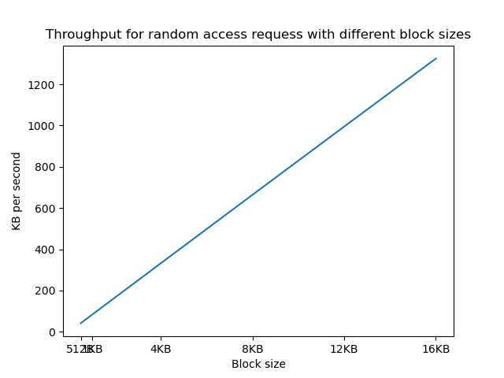
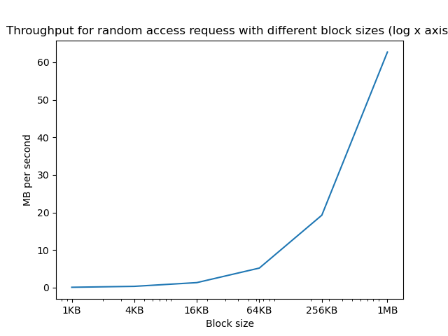

::: {#pst-skip-link .skip-link .d-print-none}
[Skip to main content](#main-content)
:::

::: {#pst-scroll-pixel-helper}
:::

Back to top

::: search-button__wrapper
::: search-button__overlay
:::

::: search-button__search-container
[[Ctrl]{.kbd .kbd-shortcut__modifier}+[K]{.kbd}]{.search-button__kbd-shortcut}
:::
:::

::: {.pst-async-banner-revealer .d-none}
:::

::: {.bd-header .navbar .navbar-expand-lg .bd-navbar .d-print-none}
:::

::: bd-container
::: {.bd-container__inner .bd-page-width}
::: {.bd-sidebar-primary .bd-sidebar}
::: {.sidebar-header-items .sidebar-primary__section}
:::

::: {.sidebar-primary-items__start .sidebar-primary__section}
::: sidebar-primary-item
[{.logo__image .only-light}](../intro/pref.html){.navbar-brand .logo}
:::

::: sidebar-primary-item
:::

::: sidebar-primary-item
::: {.bd-toc-item .navbar-nav .active}
-   [Preface](../intro/pref.html){.reference .internal}

[Getting started]{.caption-text}

-   [1. Introduction](../intro/intro.html){.reference .internal}
-   [2. Purpose of operating systems](../intro/purpose.html){.reference .internal}
-   [3. Operating System Structure & Unix/Linux](../intro/structure.html){.reference .internal}
-   [4. Operating System Abstractions](../intro/abstractions.html){.reference .internal}
-   [5. What you should know](../intro/tools.html){.reference .internal}
    []{.toctree-toggle role="presentation"}
    -   [5.1. The C Programming Language](../intro/tools-c.html){.reference .internal}
    -   [5.2. Shell](../intro/tools-shell.html){.reference .internal}
    -   [5.3. Editors](../intro/tools-editors.html){.reference .internal}
    -   [5.4. Make](../intro/tools-make.html){.reference .internal}
    -   [5.5. Testing](../intro/tools-testing.html){.reference .internal}
    -   [5.6. Git Basics](../intro/tools-git.html){.reference .internal}
    -   [5.7. GDB](../intro/tools-gdb.html){.reference .internal}

[Virtual Processor]{.caption-text}

-   [6. Introduction](../scheduling/intro.html){.reference .internal}
-   [7. The Process: A virtual Computer](../scheduling/process.html){.reference .internal}
-   [8. Virtualizing the CPU](../scheduling/virtual.html){.reference .internal}
-   [9. The Thread: A Virtual CPU](../scheduling/threads.html){.reference .internal}
-   [10. Scheduling](../scheduling/scheduling.html){.reference .internal}
    []{.toctree-toggle role="presentation"}
    -   [10.1. Scheduling Goals](../scheduling/sch-goals.html){.reference .internal}
    -   [10.2. Simple Examples of Scheduling Policies](../scheduling/sch-simple.html){.reference .internal}
    -   [10.3. Scheduling with Priorities](../scheduling/sch-prio.html){.reference .internal}
    -   [10.4. Scheduling in the real world](../scheduling/sch-real.html){.reference .internal}
-   [11. Review Questions](../scheduling/review.html){.reference .internal}

[Virtual Memory]{.caption-text}

-   [12. Introduction](../mm/intro.html){.reference .internal}
-   [13. Memory management before paged virtual memory](../mm/phys-and-seg.html){.reference .internal}
-   [14. Paged Virtual memory](../mm/pagvm.html){.reference .internal}
    []{.toctree-toggle role="presentation"}
    -   [14.1. Abstracting a useful interface for memory management.](../mm/vmabs.html){.reference .internal}
    -   [14.2. Paging](../mm/virt-paging.html){.reference .internal}
    -   [14.3. Page Tables](../mm/page-tables.html){.reference .internal}
    -   [14.4. Memory reclaiming algorithms.](../mm/reclamation.html){.reference .internal}
    -   [14.5. Page Sizes](../mm/page-size.html){.reference .internal}
    -   [14.6. Memory Management Page Faults](../mm/pagefaults.html){.reference .internal}
-   [15. Buffer Cache](../mm/buffer-cache.html){.reference .internal}
-   [16. Memory management in the real world](../mm/realworld.html){.reference .internal}
-   [17. Conclusion](../mm/concl.html){.reference .internal}
-   [18. Review](../mm/review.html){.reference .internal}

[File Systems]{.caption-text}

-   [19. Introduction](intro.html){.reference .internal}
-   [20. File System Abstraction](interface.html){.reference .internal}
-   [21. A bit about Disks](#){.current .reference .internal}
-   [22. Implementation](impl.html){.reference .internal}
    []{.toctree-toggle role="presentation"}
    -   [22.1. File System Layout](disklayout.html){.reference .internal}
    -   [22.2. Disk Layout:Tracking Used Space](dl_track_used.html){.reference .internal}
    -   [22.3. Disk Layout:Tracking Free Space](dl_track_free.html){.reference .internal}
    -   [22.4. Disk Layout:Implementing Name Space](dl_name.html){.reference .internal}
    -   [22.5. Disk Layout:Dealing with Failures](dl_failures.html){.reference .internal}
    -   [22.6. Disk Layout:Examples of Real World File Systems](dl_ex_exx.html){.reference .internal}
    -   [22.7. Kernel implementation](kernelimp.html){.reference .internal}
-   [23. Review](review.html){.reference .internal}

[Concurrency]{.caption-text}

-   [24. Introduction](../sync/sync.html){.reference .internal}
-   [25. Basic Synchronization](../sync/basic.html){.reference .internal}
    []{.toctree-toggle role="presentation"}
    -   [25.1. Cooperating Processes and Inter-process Communication](../sync/sharing.html){.reference .internal}
    -   [25.2. The Critical Section Problem](../sync/criticalsection.html){.reference .internal}
    -   [25.3. Implementing Locks](../sync/locks.html){.reference .internal}
    -   [25.4. Ordering Thread Events](../sync/ordering.html){.reference .internal}
-   [26. Common Concurrency Bugs](../sync/concurrency_bugs.html){.reference .internal}
-   [27. Advanced Synchronization](../sync/advanced.html){.reference .internal}
    []{.toctree-toggle role="presentation"}
    -   [27.1. Read-Dominated Workloads](../sync/readmostly.html){.reference .internal}
    -   [27.2. Challenges of Modern Hardware](../sync/hardware_challenges.html){.reference .internal}
    -   [27.3. Locking in the Linux Kernel](../sync/linux_locking.html){.reference .internal}
-   [28. Review](../sync/review.html){.reference .internal}

[Other Topics]{.caption-text}

-   [29. Input and Output](../devices/devices.html){.reference .internal}
-   [30. More on Disks](../devices/disk2.html){.reference .internal}
-   [31. Virtualization](../virt/virt.html){.reference .internal}
-   [32. Security](../sec/sec.html){.reference .internal}

[Appendices]{.caption-text}

-   [33. How to read this book](../misc/howto.html){.reference .internal}
-   [34. Contributing](../contributing/intro.html){.reference .internal}
    []{.toctree-toggle role="presentation"}
    -   [34.1. Examples](../contributing/examples.html){.reference .internal}
    -   [34.2. Contributors](../contributing/credit.html){.reference .internal}
    -   [34.3. Contributing](../contributing/Contributing.html){.reference .internal}
    -   [34.6. Resources to look at](../contributing/resources.html){.reference .internal}
    -   [34.7. Out of date](../contributing/fix.html){.reference .internal}
-   [35. Bibliography](../misc/bib.html){.reference .internal}
:::
:::
:::

::: {.sidebar-primary-items__end .sidebar-primary__section}
:::

::: {#rtd-footer-container}
:::
:::

::: {#main-content .bd-main role="main"}
::: sbt-scroll-pixel-helper
:::

::: bd-content
::: bd-article-container
::: {.bd-header-article .d-print-none}
::: {.header-article-items .header-article__inner}
::: header-article-items__start
::: header-article-item
[]{.fa-solid .fa-bars}
:::
:::

::: header-article-items__end
::: header-article-item
::: article-header-buttons
::: {.dropdown .dropdown-launch-buttons}

-   [[  ]{.btn__icon-container} [JupyterHub]{.btn__text-container}](https://jupyterhub-opf-jupyterhub.apps.smaug.na.operate-first.cloud/hub/user-redirect/git-pull?repo=https%3A//github.com/OpenOSOrg/openos&urlpath=lab/tree/openos/content/fs/diskhw.ipynb&branch=main "Launch on JupyterHub"){.btn .btn-sm .dropdown-item target="_blank" bs-placement="left" bs-toggle="tooltip"}
:::

::: {.dropdown .dropdown-source-buttons}

-   [[ ]{.btn__icon-container} [Repository]{.btn__text-container}](https://github.com/OpenOSOrg/openos "Source repository"){.btn .btn-sm .btn-source-repository-button .dropdown-item target="_blank" bs-placement="left" bs-toggle="tooltip"}
-   [[ ]{.btn__icon-container} [Suggest edit]{.btn__text-container}](https://github.com/OpenOSOrg/openos/edit/main/content/fs/diskhw.ipynb "Suggest edit"){.btn .btn-sm .btn-source-edit-button .dropdown-item target="_blank" bs-placement="left" bs-toggle="tooltip"}
-   [[ ]{.btn__icon-container} [Open issue]{.btn__text-container}](https://github.com/OpenOSOrg/openos/issues/new?title=Issue%20on%20page%20%2Ffs/diskhw.html&body=Your%20issue%20content%20here. "Open an issue"){.btn .btn-sm .btn-source-issues-button .dropdown-item target="_blank" bs-placement="left" bs-toggle="tooltip"}
:::

::: {.dropdown .dropdown-download-buttons}

-   [[ ]{.btn__icon-container} [.ipynb]{.btn__text-container}](../_sources/fs/diskhw.ipynb "Download source file"){.btn .btn-sm .btn-download-source-button .dropdown-item target="_blank" bs-placement="left" bs-toggle="tooltip"}
-   [ ]{.btn__icon-container} [.pdf]{.btn__text-container}
:::

[ ]{.btn__icon-container}
:::
:::
:::
:::
:::

::: {#jb-print-docs-body .onlyprint}
# A bit about Disks

::: {#print-main-content}
::: {#jb-print-toc}
:::
:::
:::

::: {#searchbox}
:::

::: {#a-bit-about-disks .section .tex2jax_ignore .mathjax_ignore}
[]{#cont-fs-disks}

# [21. ]{.section-number}A bit about Disks[\#](#a-bit-about-disks "Link to this heading"){.headerlink}

We will talk more about disks when we discuss devices later. However, most file systems have been designed to work on **hard disk drives** (often abbreviated as just **hard drives** or **HDDs**), and understanding a bit about them is important to understand how file systems work. Hard drives record data magnetically on one or more spinning platters in concentric circular tracks ([[Fig. 21.1]{.std .std-numref}](#fig-cylinders){.reference .internal}). Hard disks are *block devices*, meaning that data can only be read from, or written to, the disk in relatively large chunks. The basic unit of access for a hard disk is called a *sector*. Historically, the most common sector size was 512 B, but modern hard disks use 4 KB sectors. Each track on the disk is divided up into some number of sectors.

![[Fig. 21.1 ]{.caption-number}[A disk drive contains some number of platters, where the collection of the same track on different platters is called a cylinder.]{.caption-text}[\#](#fig-cylinders "Link to this image"){.headerlink}](../_images/disk-chs.png){style="width: 50%;"}

Data on a drive can be identified by the platter surface it is on, the track on that surface, and finally the sector on that track. To simplify the task of specifying platter, surface, track and sector, hard disks support *Logical Block Addresses* (LBAs) in which the sectors are numbered from 0 to the capacity of the disk. Software layers request data transfers using LBAs, and the drive controller translates these into the required hardware-level information, freeing software from the need to understand the disk geometry.

Reading data from a disk (or writing to it) requires the disk drive to perform the following steps:

1.  Switching the electronics to communicate with the appropriate head; in terms of performance, one can generally ignore this step, because it is fast.

2.  Performing a **seek** that moves the head assembly until the head is positioned over the target track; the time spent to do this is called the **seek time**.

3.  Waiting for the platter to rotate until the first bit of the target data is passing under the head; this time is called **rotational latency**.

4.  Reading or writing until the last bit has passed under the head; this is called the **transfer time**.

![[Fig. 21.2 ]{.caption-number}[Operations to read a disk sector.]{.caption-text}[\#](#fig-latency "Link to this image"){.headerlink}](../_images/disk-latency.png){style="width: 80%;"}

The seek and rotational latency have a major effect on disk performance. To give an example, consider randomly accessing 4 KB data blocks on a 7200 RPM (i.e., a disk that rotates 7200 times per minute). The average rotational latency would be 4 ms, i.e., 1/2 the time for a 7200 RPM drive to complete one full rotation. A typical transfer rate might be around 200 MB/s, so to transfer a 4 KB block it would take [\\((4/1000)/200 = 0.0002\\)]{.math .notranslate .nohighlight} seconds = 0.02 ms. A common seek time for a drive might be around 8 ms. We can see that the transfer time for a small 4 KB block is two orders of magnitude smaller than the positioning delays (seek and rotational latency).

Therefore, a file system that resulted in random reads (or writes) across the whole disk, would end up taking [\\(8 + 4 + 0.02 \~= 12\\)]{.math .notranslate .nohighlight} ms for each block, or having an average throughput of 333 KB/s (i.e., [\\(4/(12/1000)\\)]{.math .notranslate .nohighlight} ). If you use the minimum sector size of many disks, at 512 B, you would get only around 41 KB per second, while if you used a 16 KB block, your throughput would go up to around 1.3 MB per second.

If, on the other hand, the file system always transferred a 5 MB block, it would require [\\(8 + 4 + 25 = 37\\)]{.math .notranslate .nohighlight} ms for an average throughput of [\\(134\\)]{.math .notranslate .nohighlight} MB/s.

So, when designing a file system, for performance you want to (1) read relatively big disk blocks, and 2) have data frequently accessed together on the same tracks/cylinder, since seeking to nearby tracks is much faster.

Studies of file systems have shown that most files are 4KB or smaller, but most of the storage space is used by a small number of very big files [\[[ABDL07](../misc/bib.html#id4 "Nitin Agrawal, William J. Bolosky, John R. Douceur, and Jacob R. Lorch. A five-year study of file-system metadata. ACM Trans. Storage, 3(3):9–es, oct 2007. URL: https://doi.org/10.1145/1288783.1288788, doi:10.1145/1288783.1288788."){.reference .internal}\]]{#id1}.

[{style="width: 100%;"}](../_images/diskhw_3.png){.reference .internal .image-reference} [{style="width: 100%;"}](../_images/diskhw_4.png){.reference .internal .image-reference}
:::

::: prev-next-area
{.left-prev}

::: prev-next-info
previous

[20. ]{.section-number}File System Abstraction
:::

{.right-next}

::: prev-next-info
next

[22. ]{.section-number}Implementation
:::
:::
:::
:::

::: {.bd-footer-content__inner .container}
::: footer-item
By (see contributing chapter book)
:::

::: footer-item
© Copyright 2022.\
:::

::: footer-item
:::

::: footer-item
:::
:::
:::
:::
:::
