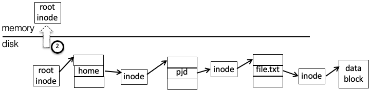
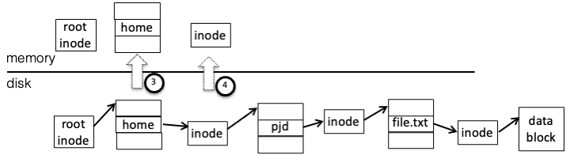
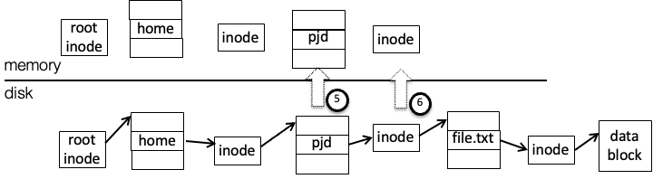
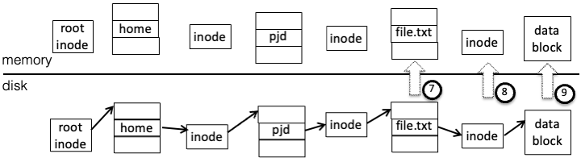

::: {#pst-skip-link .skip-link .d-print-none}
[Skip to main content](#main-content)
:::

::: {#pst-scroll-pixel-helper}
:::

Back to top

::: search-button__wrapper
::: search-button__overlay
:::

::: search-button__search-container
[[Ctrl]{.kbd .kbd-shortcut__modifier}+[K]{.kbd}]{.search-button__kbd-shortcut}
:::
:::

::: {.pst-async-banner-revealer .d-none}
:::

::: {.bd-header .navbar .navbar-expand-lg .bd-navbar .d-print-none}
:::

::: bd-container
::: {.bd-container__inner .bd-page-width}
::: {.bd-sidebar-primary .bd-sidebar}
::: {.sidebar-header-items .sidebar-primary__section}
:::

::: {.sidebar-primary-items__start .sidebar-primary__section}
::: sidebar-primary-item
[{.logo__image .only-light}](../intro/pref.html){.navbar-brand .logo}
:::

::: sidebar-primary-item
:::

::: sidebar-primary-item
::: {.bd-toc-item .navbar-nav .active}
-   [Preface](../intro/pref.html){.reference .internal}

[Getting started]{.caption-text}

-   [1. Introduction](../intro/intro.html){.reference .internal}
-   [2. Purpose of operating systems](../intro/purpose.html){.reference .internal}
-   [3. Operating System Structure & Unix/Linux](../intro/structure.html){.reference .internal}
-   [4. Operating System Abstractions](../intro/abstractions.html){.reference .internal}
-   [5. What you should know](../intro/tools.html){.reference .internal}
    []{.toctree-toggle role="presentation"}
    -   [5.1. The C Programming Language](../intro/tools-c.html){.reference .internal}
    -   [5.2. Shell](../intro/tools-shell.html){.reference .internal}
    -   [5.3. Editors](../intro/tools-editors.html){.reference .internal}
    -   [5.4. Make](../intro/tools-make.html){.reference .internal}
    -   [5.5. Testing](../intro/tools-testing.html){.reference .internal}
    -   [5.6. Git Basics](../intro/tools-git.html){.reference .internal}
    -   [5.7. GDB](../intro/tools-gdb.html){.reference .internal}

[Virtual Processor]{.caption-text}

-   [6. Introduction](../scheduling/intro.html){.reference .internal}
-   [7. The Process: A virtual Computer](../scheduling/process.html){.reference .internal}
-   [8. Virtualizing the CPU](../scheduling/virtual.html){.reference .internal}
-   [9. The Thread: A Virtual CPU](../scheduling/threads.html){.reference .internal}
-   [10. Scheduling](../scheduling/scheduling.html){.reference .internal}
    []{.toctree-toggle role="presentation"}
    -   [10.1. Scheduling Goals](../scheduling/sch-goals.html){.reference .internal}
    -   [10.2. Simple Examples of Scheduling Policies](../scheduling/sch-simple.html){.reference .internal}
    -   [10.3. Scheduling with Priorities](../scheduling/sch-prio.html){.reference .internal}
    -   [10.4. Scheduling in the real world](../scheduling/sch-real.html){.reference .internal}
-   [11. Review Questions](../scheduling/review.html){.reference .internal}

[Virtual Memory]{.caption-text}

-   [12. Introduction](../mm/intro.html){.reference .internal}
-   [13. Memory management before paged virtual memory](../mm/phys-and-seg.html){.reference .internal}
-   [14. Paged Virtual memory](../mm/pagvm.html){.reference .internal}
    []{.toctree-toggle role="presentation"}
    -   [14.1. Abstracting a useful interface for memory management.](../mm/vmabs.html){.reference .internal}
    -   [14.2. Paging](../mm/virt-paging.html){.reference .internal}
    -   [14.3. Page Tables](../mm/page-tables.html){.reference .internal}
    -   [14.4. Memory reclaiming algorithms.](../mm/reclamation.html){.reference .internal}
    -   [14.5. Page Sizes](../mm/page-size.html){.reference .internal}
    -   [14.6. Memory Management Page Faults](../mm/pagefaults.html){.reference .internal}
-   [15. Buffer Cache](../mm/buffer-cache.html){.reference .internal}
-   [16. Memory management in the real world](../mm/realworld.html){.reference .internal}
-   [17. Conclusion](../mm/concl.html){.reference .internal}
-   [18. Review](../mm/review.html){.reference .internal}

[File Systems]{.caption-text}

-   [19. Introduction](intro.html){.reference .internal}
-   [20. File System Abstraction](interface.html){.reference .internal}
-   [21. A bit about Disks](diskhw.html){.reference .internal}
-   [22. Implementation](impl.html){.reference .internal}
    []{.toctree-toggle role="presentation"}
    -   [22.1. File System Layout](disklayout.html){.reference .internal}
    -   [22.2. Disk Layout:Tracking Used Space](dl_track_used.html){.reference .internal}
    -   [22.3. Disk Layout:Tracking Free Space](dl_track_free.html){.reference .internal}
    -   [22.4. Disk Layout:Implementing Name Space](dl_name.html){.reference .internal}
    -   [22.5. Disk Layout:Dealing with Failures](dl_failures.html){.reference .internal}
    -   [22.6. Disk Layout:Examples of Real World File Systems](dl_ex_exx.html){.reference .internal}
    -   [22.7. Kernel implementation](#){.current .reference .internal}
-   [23. Review](review.html){.reference .internal}

[Concurrency]{.caption-text}

-   [24. Introduction](../sync/sync.html){.reference .internal}
-   [25. Basic Synchronization](../sync/basic.html){.reference .internal}
    []{.toctree-toggle role="presentation"}
    -   [25.1. Cooperating Processes and Inter-process Communication](../sync/sharing.html){.reference .internal}
    -   [25.2. The Critical Section Problem](../sync/criticalsection.html){.reference .internal}
    -   [25.3. Implementing Locks](../sync/locks.html){.reference .internal}
    -   [25.4. Ordering Thread Events](../sync/ordering.html){.reference .internal}
-   [26. Common Concurrency Bugs](../sync/concurrency_bugs.html){.reference .internal}
-   [27. Advanced Synchronization](../sync/advanced.html){.reference .internal}
    []{.toctree-toggle role="presentation"}
    -   [27.1. Read-Dominated Workloads](../sync/readmostly.html){.reference .internal}
    -   [27.2. Challenges of Modern Hardware](../sync/hardware_challenges.html){.reference .internal}
    -   [27.3. Locking in the Linux Kernel](../sync/linux_locking.html){.reference .internal}
-   [28. Review](../sync/review.html){.reference .internal}

[Other Topics]{.caption-text}

-   [29. Input and Output](../devices/devices.html){.reference .internal}
-   [30. More on Disks](../devices/disk2.html){.reference .internal}
-   [31. Virtualization](../virt/virt.html){.reference .internal}
-   [32. Security](../sec/sec.html){.reference .internal}

[Appendices]{.caption-text}

-   [33. How to read this book](../misc/howto.html){.reference .internal}
-   [34. Contributing](../contributing/intro.html){.reference .internal}
    []{.toctree-toggle role="presentation"}
    -   [34.1. Examples](../contributing/examples.html){.reference .internal}
    -   [34.2. Contributors](../contributing/credit.html){.reference .internal}
    -   [34.3. Contributing](../contributing/Contributing.html){.reference .internal}
    -   [34.6. Resources to look at](../contributing/resources.html){.reference .internal}
    -   [34.7. Out of date](../contributing/fix.html){.reference .internal}
-   [35. Bibliography](../misc/bib.html){.reference .internal}
:::
:::
:::

::: {.sidebar-primary-items__end .sidebar-primary__section}
:::

::: {#rtd-footer-container}
:::
:::

::: {#main-content .bd-main role="main"}
::: sbt-scroll-pixel-helper
:::

::: bd-content
::: bd-article-container
::: {.bd-header-article .d-print-none}
::: {.header-article-items .header-article__inner}
::: header-article-items__start
::: header-article-item
[]{.fa-solid .fa-bars}
:::
:::

::: header-article-items__end
::: header-article-item
::: article-header-buttons
::: {.dropdown .dropdown-launch-buttons}

-   [[  ]{.btn__icon-container} [JupyterHub]{.btn__text-container}](https://jupyterhub-opf-jupyterhub.apps.smaug.na.operate-first.cloud/hub/user-redirect/git-pull?repo=https%3A//github.com/OpenOSOrg/openos&urlpath=lab/tree/openos/content/fs/kernelimp.ipynb&branch=main "Launch on JupyterHub"){.btn .btn-sm .dropdown-item target="_blank" bs-placement="left" bs-toggle="tooltip"}
:::

::: {.dropdown .dropdown-source-buttons}

-   [[ ]{.btn__icon-container} [Repository]{.btn__text-container}](https://github.com/OpenOSOrg/openos "Source repository"){.btn .btn-sm .btn-source-repository-button .dropdown-item target="_blank" bs-placement="left" bs-toggle="tooltip"}
-   [[ ]{.btn__icon-container} [Suggest edit]{.btn__text-container}](https://github.com/OpenOSOrg/openos/edit/main/content/fs/kernelimp.ipynb "Suggest edit"){.btn .btn-sm .btn-source-edit-button .dropdown-item target="_blank" bs-placement="left" bs-toggle="tooltip"}
-   [[ ]{.btn__icon-container} [Open issue]{.btn__text-container}](https://github.com/OpenOSOrg/openos/issues/new?title=Issue%20on%20page%20%2Ffs/kernelimp.html&body=Your%20issue%20content%20here. "Open an issue"){.btn .btn-sm .btn-source-issues-button .dropdown-item target="_blank" bs-placement="left" bs-toggle="tooltip"}
:::

::: {.dropdown .dropdown-download-buttons}

-   [[ ]{.btn__icon-container} [.ipynb]{.btn__text-container}](../_sources/fs/kernelimp.ipynb "Download source file"){.btn .btn-sm .btn-download-source-button .dropdown-item target="_blank" bs-placement="left" bs-toggle="tooltip"}
-   [ ]{.btn__icon-container} [.pdf]{.btn__text-container}
:::

[ ]{.btn__icon-container}

[]{.fa-solid .fa-list}
:::
:::
:::
:::
:::

::: {#jb-print-docs-body .onlyprint}
# Kernel implementation

::: {#print-main-content}
::: {#jb-print-toc}

## Contents

-   [22.7.1. Caching](#caching){.reference .internal .nav-link}
-   [22.7.2. VFS](#vfs){.reference .internal .nav-link}
-   [22.7.3. Network File Systems](#network-file-systems){.reference .internal .nav-link}
:::
:::
:::

::: {#searchbox}
:::

::: {.admonition .warning}
Warning

This portion of the book is under construction, not ready to be read
:::

::: {#kernel-implementation .section .tex2jax_ignore .mathjax_ignore}
[]{#cont-fs-kernel}

# [22.7. ]{.section-number}Kernel implementation[\#](#kernel-implementation "Link to this heading"){.headerlink}

When applications access files they identify them by file and directory names, or by file descriptors (handles), and reads and writes may be performed in arbitrary lengths and alignments. These requests need to be translated into operations on the on-disk file system, where data is identified by its block number and all reads and writes must be in units of disk blocks.

The primary parts of this task are:

-   Path translation - given a list of path components (e.g. "usr", "local", "bin", "program") perform the directory lookups necessary to find the file or directory named by that list.

-   Read and write - translate operations on arbitrary offsets within a file to reads, writes, and allocations of complete disk blocks.

Path translation is a straightforward tree search - starting at the root directory, search for an entry for the first path component, find the location for that file or directory, and repeat until the last component of the list has been found, or an error has occurred. (Not counting permissions, there are two possible errors here---either an entry of the path was not found, or a non-final component was found but was a file rather than a directory.)

Reading requires finding the blocks which must be read, reading them in, and copying the requested data (which may not be all the data in the blocks, if the request does not start or end on a block boundary) to the appropriate locations in the user buffer.

Writing is similar, with added complications: if a write starts in the middle of a block, that block must be read in, modified, and then written back so that existing data is not lost, and if a write extends beyond the end of the file new blocks must be allocated and added to the file.

As an example, to handle the system calls

::: {.highlight-C .notranslate}
::: highlight
    fd = open("/home/pjd/file.txt", O_RDONLY) 
        read(fd, buf, 1024)
:::
:::

the kernel has to perform the following steps:

1.  Split the string `/home/pjd/file.txt`{.docutils .literal .notranslate} into parts - `home`{.docutils .literal .notranslate}, `pjd`{.docutils .literal .notranslate}, `file.txt`{.docutils .literal .notranslate}

2.  Read the root directory inode to find the location of the root directory data block. (let's assume it's a small directory, with one block)

{style="width: 80%;"}

3.  Read the root directory data block, search for `"home"`{.docutils .literal .notranslate}, and find the corresponding inode number

4.  Read the inode for the directory `"home"`{.docutils .literal .notranslate} to get the data block pointer 

5.  Read the `"home"`{.docutils .literal .notranslate} directory data block, search for `"pjd"`{.docutils .literal .notranslate} to get the inode number

6.  Read the `"pjd"`{.docutils .literal .notranslate} directory inode, get the data block pointer 

7.  Read the `"pjd"`{.docutils .literal .notranslate} directory block, and find the entry for `file.txt`{.docutils .literal .notranslate}

8.  Read the `"file.txt"`{.docutils .literal .notranslate} inode and get the first data block pointer

9.  Read the data block into the user buffer 

Most of this work (steps 2 through 7) is path translation, or the process of traversing the directory tree to find the file itself. In doing this, the OS must handle the following possibilities:

1.  The next entry in the path may not exist - the user may have typed `/hme/pjd/file.txt`{.docutils .literal .notranslate} or `/home/pjd/ffile.txt`{.docutils .literal .notranslate}

2.  An intermediate entry in the path may be a file, rather than a directory - for instance `/home/pjd/file.txt/file.txt`{.docutils .literal .notranslate}

3.  The user may not have permissions to access one of the entries in the path. On the CCIS systems, for instance, if a user other than pjd tries to access `/home/pjd/classes/file.txt`{.docutils .literal .notranslate}, the OS will notice that `/home/pjd/classes`{.docutils .literal .notranslate} is protected so that only user `pjd`{.docutils .literal .notranslate} may access it.

::: {#caching .section}
## [22.7.1. ]{.section-number}Caching[\#](#caching "Link to this heading"){.headerlink}

Disk accesses are slow, and multiple disk accesses are even slower. If every file operation required multiple disk accesses, your computer would run very slowly. Instead much of the information from the disk is cached in memory in various ways so that it can be used multiple times without going back to disk. Some of these ways are:

**File descriptors:** When an application opens a file the OS must translate the path to find the file's inode; the inode number and information from that inode can then be saved in a data structure associated with that open file (a *file descriptor* in Unix, or *file handle* in Windows), and freed when the file descriptor is closed.

**Translation caching:** An OS will typically maintain an in-memory translation cache (the dentry cache in Linux, holding individual directory entries) which holds frequently-used translations, such as root directory entries.

The directory entry cache differs from e.g. a CPU cache in that it holds both normal entries (e.g. directory+name to inode) and negative entries, indicating that directory+name does not exist[[\[]{.fn-bracket}1[\]]{.fn-bracket}](#neg){#id1 .footnote-reference .brackets role="doc-noteref"}. If no entry is found the directory is searched, and the results added to the dentry cache.

**Block caching:** To accelerate reads of frequently-accessed blocks, rather than directly reading from the disk the OS can maintain a *block cache*. Before going to disk the OS checks to see whether a copy of the disk block is already present; if so the data can be copied directly, and if not it is read from disk and inserted into the cache before being returned. When data is modified it can be written to this cache and written back later to the disk.

Among other things, this allows small reads (smaller than a disk block) and small writes to be more efficient. The first small read will cause the block to be read from disk into cache, while following reads from the same block will come from cache. Small writes will modify the same block in cache, and if a block is not flushed immediately to disk, it can be modified multiple times while only resulting in a single write.

Modern OSes like Linux use a combined buffer cache, where virtual memory pages and the file system cache come from the same pool. It's a bit complicated, and is not covered in this class.
:::

::: {#vfs .section}
## [22.7.2. ]{.section-number}VFS[\#](#vfs "Link to this heading"){.headerlink}

In order to support multiple file systems such as Ext3, CD-ROMs, and others at the same time, Linux and other Unix variants use an interface called VFS, or the Virtual File System interface. (Windows uses a much different interface with the same purpose.) The core of the OS does not know how to interpret individual file systems; instead it knows how to make requests across the VFS interface. Each file system registers an interface with VFS, and the methods in this interface implement the file system by talking to e.g., a disk or a network server.

VFS objects all exist in memory; any association between these structures and data on disk is the responsibility of the file system code. The important objects and methods in this interface are:

`superblock`{.docutils .literal .notranslate}. Not to be confused with the superblock on disk, this object corresponds to a mounted file system; in particular, the system *mount table* holds pointers to superblock structures. The most important field in the superblock object is a pointer to the root directory `inode`{.docutils .literal .notranslate}.

`inode`{.docutils .literal .notranslate} - this corresponds to a file or directory. Its methods allow attributes (owner, timestamp, etc.) to be modified; in addition, if the object corresponds to a directory, other methods allow creating, deleting, and renaming entries, as well as looking up a string to return a directory entry.

`dentry`{.docutils .literal .notranslate} - an object corresponding to a directory entry, as described earlier. It holds a name and a pointer to the corresponding `inode `{.docutils .literal .notranslate}object, and no interesting methods.

`file`{.docutils .literal .notranslate} - this corresponds to an open file. When it is created there is no associated "real" file; its open method is called with a `dentry`{.docutils .literal .notranslate} pointing to the file to open.

To open a file the OS will start with the root directory inode (from the superblock object) and call `lookup`{.docutils .literal .notranslate}, getting back a `dentry`{.docutils .literal .notranslate} with a pointer to the next directory, etc. When the dentry for the file is found, the OS will create a file object and pass the dentry to the file object's open method.

**FUSE** (File system in User Space) is a file system type in Linux which does not actually implement a file system itself, but instead forwards VFS requests to a user-space process, and then takes the responses from that process and passes them back to the kernel.

Like VFS, the FUSE interface consists of a series of methods which you must implement, and if you implement them correctly and return consistent results, the kernel (and applications running on top of it) will see a file system. Unlike VFS, FUSE includes various levels of user-friendly support; we will use it in a mode where all objects are identified by human-readable path strings, rather than dentries and inodes.

-   `getattr`{.docutils .literal .notranslate} - return attributes (size, owner, etc.) of a file or directory.

-   `readdir`{.docutils .literal .notranslate} - list a directory

-   `mkdir`{.docutils .literal .notranslate}, `rmdir`{.docutils .literal .notranslate}, `create`{.docutils .literal .notranslate}, `unlink`{.docutils .literal .notranslate} - create and remove directories and files

-   `read`{.docutils .literal .notranslate}, `write`{.docutils .literal .notranslate} - note that these identify the offset in the file, as the kernel (not the file system) handles file positions.

-   `rename`{.docutils .literal .notranslate} - change a name in a directory entry

-   `truncate`{.docutils .literal .notranslate} - shorten a file

-   ... and others, most of which are optional.
:::

::: {#network-file-systems .section}
## [22.7.3. ]{.section-number}Network File Systems[\#](#network-file-systems "Link to this heading"){.headerlink}

The file systems discussed so far are local file systems, where data is stored on local disk and is only directly accessible from the computer attached to that disk. Network file systems are used when we want access to data from multiple machines.

The two network file systems in most common use today are Unix NFS (Network File System) and Windows SMB (also known as CIFS). Each protocol provides operations somewhat similar to those in VFS (quite similar in the case of NFS, as the original VFS was designed for it), allowing the kernel to traverse and list directories, create and delete files, and read and write arbitrary offsets within a file.

The primary differences between the NFS (up through v3 at least, v4 is more complicated) and SMB are:

-   State - NFS is designed to be stateless for reliability. Once you have obtained a file's unique ID (from the directory entry) you can just read from or write to a location in it, without opening the file. Operations are idempotent, which means they can be repeated multiple times without error (e.g., writing page P to offset x can be repeated, while appending page P to the end of the file can't). In contrast SMB is connection-oriented, and requires files and directories to be opened before they can be operated on. NFS tolerates server crashes and restarts more gracefully, but does not have some of the connection-related features in SMB such as authentication, described below.

-   Identity - NFS acts like a local file system, trusting the client to authenticate users and pass numeric user IDs to the server. SMB handles authentication on the server side---each connection to the server begins with a handshake that authenticates to the server with a specific username, and all operations within that connection are done as that user.

------------------------------------------------------------------------

[[\[]{.fn-bracket}[1](#id1){role="doc-backlink"}[\]]{.fn-bracket}]{.label}

To be a bit formal about it, a CPU cache maps a *dense* address space, where every key has a value, while the translation cache maps a *sparse* address space.
:::
:::

::: prev-next-area
{.left-prev}

::: prev-next-info
previous

[22.6. ]{.section-number}Disk Layout:Examples of Real World File Systems
:::

{.right-next}

::: prev-next-info
next

[23. ]{.section-number}Review
:::
:::
:::

::: {.bd-sidebar-secondary .bd-toc}
::: {.sidebar-secondary-items .sidebar-secondary__inner}
::: sidebar-secondary-item
::: {.page-toc .tocsection .onthispage}
Contents
:::

-   [22.7.1. Caching](#caching){.reference .internal .nav-link}
-   [22.7.2. VFS](#vfs){.reference .internal .nav-link}
-   [22.7.3. Network File Systems](#network-file-systems){.reference .internal .nav-link}
:::
:::
:::
:::

::: {.bd-footer-content__inner .container}
::: footer-item
By (see contributing chapter book)
:::

::: footer-item
© Copyright 2022.\
:::

::: footer-item
:::

::: footer-item
:::
:::
:::
:::
:::
