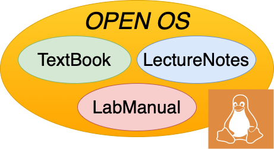

::: {#pst-skip-link .skip-link .d-print-none}
[Skip to main content](#main-content)
:::

::: {#pst-scroll-pixel-helper}
:::

Back to top

::: search-button__wrapper
::: search-button__overlay
:::

::: search-button__search-container
[[Ctrl]{.kbd .kbd-shortcut__modifier}+[K]{.kbd}]{.search-button__kbd-shortcut}
:::
:::

::: {.pst-async-banner-revealer .d-none}
:::

::: {.bd-header .navbar .navbar-expand-lg .bd-navbar .d-print-none}
:::

::: bd-container
::: {.bd-container__inner .bd-page-width}
::: {.bd-sidebar-primary .bd-sidebar}
::: {.sidebar-header-items .sidebar-primary__section}
:::

::: {.sidebar-primary-items__start .sidebar-primary__section}
::: sidebar-primary-item
[{.logo__image .only-light}](../intro/pref.html){.navbar-brand .logo}
:::

::: sidebar-primary-item
:::

::: sidebar-primary-item
::: {.bd-toc-item .navbar-nav .active}

- [Preface](../intro/pref.html){.reference .internal}

[Getting started]{.caption-text}

- [1. Introduction](../intro/intro.html){.reference .internal}
- [2. Purpose of operating systems](../intro/purpose.html){.reference .internal}
- [3. Operating System Structure & Unix/Linux](../intro/structure.html){.reference .internal}
- [4. Operating System Abstractions](../intro/abstractions.html){.reference .internal}
- [5. What you should know](../intro/tools.html){.reference .internal}
  []{.toctree-toggle role="presentation"}
  - [5.1. The C Programming Language](../intro/tools-c.html){.reference .internal}
  - [5.2. Shell](../intro/tools-shell.html){.reference .internal}
  - [5.3. Editors](../intro/tools-editors.html){.reference .internal}
  - [5.4. Make](../intro/tools-make.html){.reference .internal}
  - [5.5. Testing](../intro/tools-testing.html){.reference .internal}
  - [5.6. Git Basics](../intro/tools-git.html){.reference .internal}
  - [5.7. GDB](../intro/tools-gdb.html){.reference .internal}

[Virtual Processor]{.caption-text}

- [6. Introduction](../scheduling/intro.html){.reference .internal}
- [7. The Process: A virtual Computer](../scheduling/process.html){.reference .internal}
- [8. Virtualizing the CPU](../scheduling/virtual.html){.reference .internal}
- [9. The Thread: A Virtual CPU](../scheduling/threads.html){.reference .internal}
- [10. Scheduling](../scheduling/scheduling.html){.reference .internal}
  []{.toctree-toggle role="presentation"}
  - [10.1. Scheduling Goals](../scheduling/sch-goals.html){.reference .internal}
  - [10.2. Simple Examples of Scheduling Policies](../scheduling/sch-simple.html){.reference .internal}
  - [10.3. Scheduling with Priorities](../scheduling/sch-prio.html){.reference .internal}
  - [10.4. Scheduling in the real world](../scheduling/sch-real.html){.reference .internal}
- [11. Review Questions](../scheduling/review.html){.reference .internal}

[Virtual Memory]{.caption-text}

- [12. Introduction](../mm/intro.html){.reference .internal}
- [13. Memory management before paged virtual memory](../mm/phys-and-seg.html){.reference .internal}
- [14. Paged Virtual memory](../mm/pagvm.html){.reference .internal}
  []{.toctree-toggle role="presentation"}
  - [14.1. Abstracting a useful interface for memory management.](../mm/vmabs.html){.reference .internal}
  - [14.2. Paging](../mm/virt-paging.html){.reference .internal}
  - [14.3. Page Tables](../mm/page-tables.html){.reference .internal}
  - [14.4. Memory reclaiming algorithms.](../mm/reclamation.html){.reference .internal}
  - [14.5. Page Sizes](../mm/page-size.html){.reference .internal}
  - [14.6. Memory Management Page Faults](../mm/pagefaults.html){.reference .internal}
- [15. Buffer Cache](../mm/buffer-cache.html){.reference .internal}
- [16. Memory management in the real world](../mm/realworld.html){.reference .internal}
- [17. Conclusion](../mm/concl.html){.reference .internal}
- [18. Review](../mm/review.html){.reference .internal}

[File Systems]{.caption-text}

- [19. Introduction](../fs/intro.html){.reference .internal}
- [20. File System Abstraction](../fs/interface.html){.reference .internal}
- [21. A bit about Disks](../fs/diskhw.html){.reference .internal}
- [22. Implementation](../fs/impl.html){.reference .internal}
  []{.toctree-toggle role="presentation"}
  - [22.1. File System Layout](../fs/disklayout.html){.reference .internal}
  - [22.2. Disk Layout:Tracking Used Space](../fs/dl_track_used.html){.reference .internal}
  - [22.3. Disk Layout:Tracking Free Space](../fs/dl_track_free.html){.reference .internal}
  - [22.4. Disk Layout:Implementing Name Space](../fs/dl_name.html){.reference .internal}
  - [22.5. Disk Layout:Dealing with Failures](../fs/dl_failures.html){.reference .internal}
  - [22.6. Disk Layout:Examples of Real World File Systems](../fs/dl_ex_exx.html){.reference .internal}
  - [22.7. Kernel implementation](../fs/kernelimp.html){.reference .internal}
- [23. Review](../fs/review.html){.reference .internal}

[Concurrency]{.caption-text}

- [24. Introduction](../sync/sync.html){.reference .internal}
- [25. Basic Synchronization](../sync/basic.html){.reference .internal}
  []{.toctree-toggle role="presentation"}
  - [25.1. Cooperating Processes and Inter-process Communication](../sync/sharing.html){.reference .internal}
  - [25.2. The Critical Section Problem](../sync/criticalsection.html){.reference .internal}
  - [25.3. Implementing Locks](../sync/locks.html){.reference .internal}
  - [25.4. Ordering Thread Events](../sync/ordering.html){.reference .internal}
- [26. Common Concurrency Bugs](../sync/concurrency_bugs.html){.reference .internal}
- [27. Advanced Synchronization](../sync/advanced.html){.reference .internal}
  []{.toctree-toggle role="presentation"}
  - [27.1. Read-Dominated Workloads](../sync/readmostly.html){.reference .internal}
  - [27.2. Challenges of Modern Hardware](../sync/hardware_challenges.html){.reference .internal}
  - [27.3. Locking in the Linux Kernel](../sync/linux_locking.html){.reference .internal}
- [28. Review](../sync/review.html){.reference .internal}

[Other Topics]{.caption-text}

- [29. Input and Output](../devices/devices.html){.reference .internal}
- [30. More on Disks](../devices/disk2.html){.reference .internal}
- [31. Virtualization](../virt/virt.html){.reference .internal}
- [32. Security](../sec/sec.html){.reference .internal}

[Appendices]{.caption-text}

- [33. How to read this book](howto.html){.reference .internal}
- [34. Contributing](../contributing/intro.html){.reference .internal}
  []{.toctree-toggle role="presentation"}
  - [34.1. Examples](../contributing/examples.html){.reference .internal}
  - [34.2. Contributors](../contributing/credit.html){.reference .internal}
  - [34.3. Contributing](../contributing/Contributing.html){.reference .internal}
  - [34.6. Resources to look at](../contributing/resources.html){.reference .internal}
  - [34.7. Out of date](../contributing/fix.html){.reference .internal}
- [35. Bibliography](#){.current .reference .internal}
  :::
  :::
  :::

::: {.sidebar-primary-items__end .sidebar-primary__section}
:::

::: {#rtd-footer-container}
:::
:::

::: {#main-content .bd-main role="main"}
::: sbt-scroll-pixel-helper
:::

::: bd-content
::: bd-article-container
::: {.bd-header-article .d-print-none}
::: {.header-article-items .header-article__inner}
::: header-article-items__start
::: header-article-item
[]{.fa-solid .fa-bars}
:::
:::

::: header-article-items__end
::: header-article-item
::: article-header-buttons
::: {.dropdown .dropdown-launch-buttons}

- [[  ]{.btn__icon-container} [JupyterHub]{.btn__text-container}](https://jupyterhub-opf-jupyterhub.apps.smaug.na.operate-first.cloud/hub/user-redirect/git-pull?repo=https%3A//github.com/OpenOSOrg/openos&urlpath=lab/tree/openos/content/misc/bib.ipynb&branch=main "Launch on JupyterHub"){.btn .btn-sm .dropdown-item target="_blank" bs-placement="left" bs-toggle="tooltip"}
  :::

::: {.dropdown .dropdown-source-buttons}

- [[ ]{.btn__icon-container} [Repository]{.btn__text-container}](https://github.com/OpenOSOrg/openos "Source repository"){.btn .btn-sm .btn-source-repository-button .dropdown-item target="_blank" bs-placement="left" bs-toggle="tooltip"}
- [[ ]{.btn__icon-container} [Suggest edit]{.btn__text-container}](https://github.com/OpenOSOrg/openos/edit/main/content/misc/bib.ipynb "Suggest edit"){.btn .btn-sm .btn-source-edit-button .dropdown-item target="_blank" bs-placement="left" bs-toggle="tooltip"}
- [[ ]{.btn__icon-container} [Open issue]{.btn__text-container}](https://github.com/OpenOSOrg/openos/issues/new?title=Issue%20on%20page%20%2Fmisc/bib.html&body=Your%20issue%20content%20here. "Open an issue"){.btn .btn-sm .btn-source-issues-button .dropdown-item target="_blank" bs-placement="left" bs-toggle="tooltip"}
  :::

::: {.dropdown .dropdown-download-buttons}

- [[ ]{.btn__icon-container} [.ipynb]{.btn__text-container}](../_sources/misc/bib.ipynb "Download source file"){.btn .btn-sm .btn-download-source-button .dropdown-item target="_blank" bs-placement="left" bs-toggle="tooltip"}

-  [ ]{.btn__icon-container} [.pdf]{.btn__text-container}
  :::

[ ]{.btn__icon-container}
:::
:::
:::
:::
:::

::: {#jb-print-docs-body .onlyprint}

# Bibliography

::: {#print-main-content}
::: {#jb-print-toc}
:::
:::
:::

::: {#searchbox}
:::

::: {#bibliography .section .tex2jax_ignore .mathjax_ignore}

# [35. ] {.section-number}Bibliography[\#](#bibliography "Link to this heading") {.headerlink}

::: {#id1 .docutils .container}
::: {.citation-list role="list"}
::: {#id16 .citation role="doc-biblioentry"}
[[\[]{.fn-bracket}AASEH17[\]]{.fn-bracket}]{.label}

Abbaspour Asadollah, S., Sundmark, D., Eldh, S., and Hans Hansson. Concurrency bugs in open source software: a case study. *Journal of Internet Services and Applications*, 8(4):1--15, apr 2017. URL: [https://doi.org/10.1186/s13174-017-0055-2](https://doi.org/10.1186/s13174-017-0055-2){.reference .external}, [doi:10.1186/s13174-017-0055-2](https://doi.org/10.1186/s13174-017-0055-2){.reference .external}.
:::

::: {#id4 .citation role="doc-biblioentry"}
[[\[]{.fn-bracket}ABDL07[\]]{.fn-bracket}]{.label}

Nitin Agrawal, William J. Bolosky, John R. Douceur, and Jacob R. Lorch. A five-year study of file-system metadata. *ACM Trans. Storage*, 3(3):9--es, oct 2007. URL: [https://doi.org/10.1145/1288783.1288788](https://doi.org/10.1145/1288783.1288788){.reference .external}, [doi:10.1145/1288783.1288788](https://doi.org/10.1145/1288783.1288788){.reference .external}.
:::

::: {#id19 .citation role="doc-biblioentry"}
[[\[]{.fn-bracket}ABLL91[\]]{.fn-bracket}]{.label}

Thomas E. Anderson, Brian N. Bershad, Edward D. Lazowska, and Henry M. Levy. Scheduler activations: effective kernel support for the user-level management of parallelism. In *Proceedings of the Thirteenth ACM Symposium on Operating Systems Principles*, SOSP \'91, 95--109. New York, NY, USA, 1991. Association for Computing Machinery. URL: [https://doi.org/10.1145/121132.121151](https://doi.org/10.1145/121132.121151){.reference .external}, [doi:10.1145/121132.121151](https://doi.org/10.1145/121132.121151){.reference .external}.
:::

::: {#id2 .citation role="doc-biblioentry"}
[[\[]{.fn-bracket}ADAD18[\]]{.fn-bracket}]{.label}

Remzi H Arpaci-Dusseau and Andrea C Arpaci-Dusseau. *Operating systems: Three easy pieces*. Arpaci-Dusseau Books LLC Boston, 2018. URL: [https://pages.cs.wisc.edu/\~remzi/OSTEP/](https://pages.cs.wisc.edu/~remzi/OSTEP/){.reference .external}.
:::

::: {#id3 .citation role="doc-biblioentry"}
[[\[]{.fn-bracket}BAKR19[\]]{.fn-bracket}]{.label}

Andrew Baumann, Jonathan Appavoo, Orran Krieger, and Timothy Roscoe. A fork() in the road. In *Proceedings of the Workshop on Hot Topics in Operating Systems*, HotOS \'19, 14--22. New York, NY, USA, 2019. Association for Computing Machinery. URL: [https://doi.org/10.1145/3317550.3321435](https://doi.org/10.1145/3317550.3321435){.reference .external}, [doi:10.1145/3317550.3321435](https://doi.org/10.1145/3317550.3321435){.reference .external}.
:::

::: {#id11 .citation role="doc-biblioentry"}
[[\[]{.fn-bracket}CES71[\]]{.fn-bracket}]{.label}

E. G. Coffman, M. Elphick, and A. Shoshani. System deadlocks. *ACM Comput. Surv.*, 3(2):67--78, jun 1971. URL: [https://doi.org/10.1145/356586.356588](https://doi.org/10.1145/356586.356588){.reference .external}, [doi:10.1145/356586.356588](https://doi.org/10.1145/356586.356588){.reference .external}.
:::

::: {#id17 .citation role="doc-biblioentry"}
[[\[]{.fn-bracket}CHP71[\]]{.fn-bracket}]{.label}

P. J. Courtois, F. Heymans, and D. L. Parnas. Concurrent control with "readers" and "writers". *Commun. ACM*, 14(10):667--668, oct 1971. URL: [https://doi.org/10.1145/362759.362813](https://doi.org/10.1145/362759.362813){.reference .external}, [doi:10.1145/362759.362813](https://doi.org/10.1145/362759.362813){.reference .external}.
:::

::: {#id5 .citation role="doc-biblioentry"}
[[\[]{.fn-bracket}Dij65[\]]{.fn-bracket}]{.label}

**missing institution in 10.5555/1102034**
:::

::: {#id18 .citation role="doc-biblioentry"}
[[\[]{.fn-bracket}HMBW07[\]]{.fn-bracket}]{.label}

Thomas E. Hart, Paul E. McKenney, Angela Demke Brown, and Jonathan Walpole. Performance of memory reclamation for lockless synchronization. *J. Parallel Distrib. Comput.*, 67(12):1270--1285, dec 2007. URL: [https://doi.org/10.1016/j.jpdc.2007.04.010](https://doi.org/10.1016/j.jpdc.2007.04.010){.reference .external}, [doi:10.1016/j.jpdc.2007.04.010](https://doi.org/10.1016/j.jpdc.2007.04.010){.reference .external}.
:::

::: {#id13 .citation role="doc-biblioentry"}
[[\[]{.fn-bracket}Her90[\]]{.fn-bracket}]{.label}

M. Herlihy. A methodology for implementing highly concurrent data structures. In *Proceedings of the Second ACM SIGPLAN Symposium on Principles & Practice of Parallel Programming*, PPOPP \'90, 197--206. New York, NY, USA, 1990. Association for Computing Machinery. URL: [https://doi.org/10.1145/99163.99185](https://doi.org/10.1145/99163.99185){.reference .external}, [doi:10.1145/99163.99185](https://doi.org/10.1145/99163.99185){.reference .external}.
:::

::: {#id14 .citation role="doc-biblioentry"}
[[\[]{.fn-bracket}Her93[\]]{.fn-bracket}]{.label}

Maurice Herlihy. A methodology for implementing highly concurrent data objects. *ACM Trans. Program. Lang. Syst.*, 15(5):745--770, nov 1993. URL: [https://doi.org/10.1145/161468.161469](https://doi.org/10.1145/161468.161469){.reference .external}, [doi:10.1145/161468.161469](https://doi.org/10.1145/161468.161469){.reference .external}.
:::

::: {#id12 .citation role="doc-biblioentry"}
[[\[]{.fn-bracket}Hol72[\]]{.fn-bracket}]{.label}

Richard C. Holt. Some deadlock properties of computer systems. *ACM Comput. Surv.*, 4(3):179--196, sep 1972. URL: [https://doi.org/10.1145/356603.356607](https://doi.org/10.1145/356603.356607){.reference .external}, [doi:10.1145/356603.356607](https://doi.org/10.1145/356603.356607){.reference .external}.
:::

::: {#id9 .citation role="doc-biblioentry"}
[[\[]{.fn-bracket}Lam74[\]]{.fn-bracket}]{.label}

Leslie Lamport. A new solution of dijkstra\'s concurrent programming problem. *Commun. ACM*, 17(8):453--455, aug 1974. URL: [https://doi.org/10.1145/361082.361093](https://doi.org/10.1145/361082.361093){.reference .external}, [doi:10.1145/361082.361093](https://doi.org/10.1145/361082.361093){.reference .external}.
:::

::: {#id10 .citation role="doc-biblioentry"}
[[\[]{.fn-bracket}LPSZ08[\]]{.fn-bracket}]{.label}

Shan Lu, Soyeon Park, Eunsoo Seo, and Yuanyuan Zhou. Learning from mistakes: a comprehensive study on real world concurrency bug characteristics. In *Proceedings of the 13th International Conference on Architectural Support for Programming Languages and Operating Systems*, ASPLOS XIII, 329--339. New York, NY, USA, 2008. Association for Computing Machinery. URL: [https://doi.org/10.1145/1346281.1346323](https://doi.org/10.1145/1346281.1346323){.reference .external}, [doi:10.1145/1346281.1346323](https://doi.org/10.1145/1346281.1346323){.reference .external}.
:::

::: {#id8 .citation role="doc-biblioentry"}
[[\[]{.fn-bracket}MCS91[\]]{.fn-bracket}]{.label}

John M. Mellor-Crummey and Michael L. Scott. Algorithms for scalable synchronization on shared-memory multiprocessors. *ACM Trans. Comput. Syst.*, 9(1):21--65, feb 1991. URL: [https://doi.org/10.1145/103727.103729](https://doi.org/10.1145/103727.103729){.reference .external}, [doi:10.1145/103727.103729](https://doi.org/10.1145/103727.103729){.reference .external}.
:::

::: {#id6 .citation role="doc-biblioentry"}
[[\[]{.fn-bracket}Pet81[\]]{.fn-bracket}]{.label}

Gary L. Peterson. Myths about the mutual exclusion problem. *Information Processing Letters*, 12:115--116, 1981.
:::

::: {#id7 .citation role="doc-biblioentry"}
[[\[]{.fn-bracket}Sch97[\]]{.fn-bracket}]{.label}

Fred B. Schneider. *On Concurrent Programming*. Springer New York NY, 1997. [doi:10.1007/978-1-4612-1830-2](https://doi.org/10.1007/978-1-4612-1830-2){.reference .external}.
:::

::: {#id15 .citation role="doc-biblioentry"}
[[\[]{.fn-bracket}TB14[\]]{.fn-bracket}]{.label}

Andrew S. Tanenbaum and Herbert Bos. *Modern Operating Systems*. Prentice Hall Press, USA, 4th edition, 2014. ISBN 013359162X.
:::
:::
:::
:::

::: prev-next-area
{.left-prev}

::: prev-next-info
previous

[34.7. ]{.section-number}Out of date
:::
:::
:::
:::

::: {.bd-footer-content__inner .container}
::: footer-item
By (see contributing chapter book)
:::

::: footer-item
© Copyright 2022.
:::

::: footer-item
:::

::: footer-item
:::
:::
:::
:::
:::
