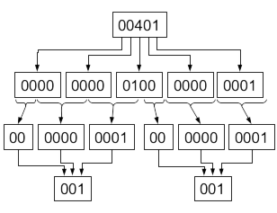

::: {#pst-skip-link .skip-link .d-print-none}
[Skip to main content](#main-content)
:::

::: {#pst-scroll-pixel-helper}
:::

Back to top

::: search-button__wrapper
::: search-button__overlay
:::

::: search-button__search-container
[[Ctrl]{.kbd .kbd-shortcut__modifier}+[K]{.kbd}]{.search-button__kbd-shortcut}
:::
:::

::: {.pst-async-banner-revealer .d-none}
:::

::: {.bd-header .navbar .navbar-expand-lg .bd-navbar .d-print-none}
:::

::: bd-container
::: {.bd-container__inner .bd-page-width}
::: {.bd-sidebar-primary .bd-sidebar}
::: {.sidebar-header-items .sidebar-primary__section}
:::

::: {.sidebar-primary-items__start .sidebar-primary__section}
::: sidebar-primary-item
[{.logo__image .only-light}](../intro/pref.html){.navbar-brand .logo}
:::

::: sidebar-primary-item
:::

::: sidebar-primary-item
::: {.bd-toc-item .navbar-nav .active}

- [Preface](../intro/pref.html){.reference .internal}

[Getting started]{.caption-text}

- [1. Introduction](../intro/intro.html){.reference .internal}
- [2. Purpose of operating systems](../intro/purpose.html){.reference .internal}
- [3. Operating System Structure & Unix/Linux](../intro/structure.html){.reference .internal}
- [4. Operating System Abstractions](../intro/abstractions.html){.reference .internal}
- [5. What you should know](../intro/tools.html){.reference .internal}
  []{.toctree-toggle role="presentation"}
  - [5.1. The C Programming Language](../intro/tools-c.html){.reference .internal}
  - [5.2. Shell](../intro/tools-shell.html){.reference .internal}
  - [5.3. Editors](../intro/tools-editors.html){.reference .internal}
  - [5.4. Make](../intro/tools-make.html){.reference .internal}
  - [5.5. Testing](../intro/tools-testing.html){.reference .internal}
  - [5.6. Git Basics](../intro/tools-git.html){.reference .internal}
  - [5.7. GDB](../intro/tools-gdb.html){.reference .internal}

[Virtual Processor]{.caption-text}

- [6. Introduction](../scheduling/intro.html){.reference .internal}
- [7. The Process: A virtual Computer](../scheduling/process.html){.reference .internal}
- [8. Virtualizing the CPU](../scheduling/virtual.html){.reference .internal}
- [9. The Thread: A Virtual CPU](../scheduling/threads.html){.reference .internal}
- [10. Scheduling](../scheduling/scheduling.html){.reference .internal}
  []{.toctree-toggle role="presentation"}
  - [10.1. Scheduling Goals](../scheduling/sch-goals.html){.reference .internal}
  - [10.2. Simple Examples of Scheduling Policies](../scheduling/sch-simple.html){.reference .internal}
  - [10.3. Scheduling with Priorities](../scheduling/sch-prio.html){.reference .internal}
  - [10.4. Scheduling in the real world](../scheduling/sch-real.html){.reference .internal}
- [11. Review Questions](../scheduling/review.html){.reference .internal}

[Virtual Memory]{.caption-text}

- [12. Introduction](intro.html){.reference .internal}
- [13. Memory management before paged virtual memory](phys-and-seg.html){.reference .internal}
- [14. Paged Virtual memory](pagvm.html){.reference .internal}
  []{.toctree-toggle role="presentation"}
  - [14.1. Abstracting a useful interface for memory management.](vmabs.html){.reference .internal}
  - [14.2. Paging](virt-paging.html){.reference .internal}
  - [14.3. Page Tables](#){.current .reference .internal}
  - [14.4. Memory reclaiming algorithms.](reclamation.html){.reference .internal}
  - [14.5. Page Sizes](page-size.html){.reference .internal}
  - [14.6. Memory Management Page Faults](pagefaults.html){.reference .internal}
- [15. Buffer Cache](buffer-cache.html){.reference .internal}
- [16. Memory management in the real world](realworld.html){.reference .internal}
- [17. Conclusion](concl.html){.reference .internal}
- [18. Review](review.html){.reference .internal}

[File Systems]{.caption-text}

- [19. Introduction](../fs/intro.html){.reference .internal}
- [20. File System Abstraction](../fs/interface.html){.reference .internal}
- [21. A bit about Disks](../fs/diskhw.html){.reference .internal}
- [22. Implementation](../fs/impl.html){.reference .internal}
  []{.toctree-toggle role="presentation"}
  - [22.1. File System Layout](../fs/disklayout.html){.reference .internal}
  - [22.2. Disk Layout:Tracking Used Space](../fs/dl_track_used.html){.reference .internal}
  - [22.3. Disk Layout:Tracking Free Space](../fs/dl_track_free.html){.reference .internal}
  - [22.4. Disk Layout:Implementing Name Space](../fs/dl_name.html){.reference .internal}
  - [22.5. Disk Layout:Dealing with Failures](../fs/dl_failures.html){.reference .internal}
  - [22.6. Disk Layout:Examples of Real World File Systems](../fs/dl_ex_exx.html){.reference .internal}
  - [22.7. Kernel implementation](../fs/kernelimp.html){.reference .internal}
- [23. Review](../fs/review.html){.reference .internal}

[Concurrency]{.caption-text}

- [24. Introduction](../sync/sync.html){.reference .internal}
- [25. Basic Synchronization](../sync/basic.html){.reference .internal}
  []{.toctree-toggle role="presentation"}
  - [25.1. Cooperating Processes and Inter-process Communication](../sync/sharing.html){.reference .internal}
  - [25.2. The Critical Section Problem](../sync/criticalsection.html){.reference .internal}
  - [25.3. Implementing Locks](../sync/locks.html){.reference .internal}
  - [25.4. Ordering Thread Events](../sync/ordering.html){.reference .internal}
- [26. Common Concurrency Bugs](../sync/concurrency_bugs.html){.reference .internal}
- [27. Advanced Synchronization](../sync/advanced.html){.reference .internal}
  []{.toctree-toggle role="presentation"}
  - [27.1. Read-Dominated Workloads](../sync/readmostly.html){.reference .internal}
  - [27.2. Challenges of Modern Hardware](../sync/hardware_challenges.html){.reference .internal}
  - [27.3. Locking in the Linux Kernel](../sync/linux_locking.html){.reference .internal}
- [28. Review](../sync/review.html){.reference .internal}

[Other Topics]{.caption-text}

- [29. Input and Output](../devices/devices.html){.reference .internal}
- [30. More on Disks](../devices/disk2.html){.reference .internal}
- [31. Virtualization](../virt/virt.html){.reference .internal}
- [32. Security](../sec/sec.html){.reference .internal}

[Appendices]{.caption-text}

- [33. How to read this book](../misc/howto.html){.reference .internal}
- [34. Contributing](../contributing/intro.html){.reference .internal}
  []{.toctree-toggle role="presentation"}
  - [34.1. Examples](../contributing/examples.html){.reference .internal}
  - [34.2. Contributors](../contributing/credit.html){.reference .internal}
  - [34.3. Contributing](../contributing/Contributing.html){.reference .internal}
  - [34.6. Resources to look at](../contributing/resources.html){.reference .internal}
  - [34.7. Out of date](../contributing/fix.html){.reference .internal}
- [35. Bibliography](../misc/bib.html){.reference .internal}
  :::
  :::
  :::

::: {.sidebar-primary-items__end .sidebar-primary__section}
:::

::: {#rtd-footer-container}
:::
:::

::: {#main-content .bd-main role="main"}
::: sbt-scroll-pixel-helper
:::

::: bd-content
::: bd-article-container
::: {.bd-header-article .d-print-none}
::: {.header-article-items .header-article__inner}
::: header-article-items__start
::: header-article-item
[]{.fa-solid .fa-bars}
:::
:::

::: header-article-items__end
::: header-article-item
::: article-header-buttons
::: {.dropdown .dropdown-launch-buttons}

- [[  ]{.btn__icon-container} [JupyterHub]{.btn__text-container}](https://jupyterhub-opf-jupyterhub.apps.smaug.na.operate-first.cloud/hub/user-redirect/git-pull?repo=https%3A//github.com/OpenOSOrg/openos&urlpath=lab/tree/openos/content/mm/page-tables.ipynb&branch=main "Launch on JupyterHub"){.btn .btn-sm .dropdown-item target="_blank" bs-placement="left" bs-toggle="tooltip"}
  :::

::: {.dropdown .dropdown-source-buttons}

- [[ ]{.btn__icon-container} [Repository]{.btn__text-container}](https://github.com/OpenOSOrg/openos "Source repository"){.btn .btn-sm .btn-source-repository-button .dropdown-item target="_blank" bs-placement="left" bs-toggle="tooltip"}
- [[ ]{.btn__icon-container} [Suggest edit]{.btn__text-container}](https://github.com/OpenOSOrg/openos/edit/main/content/mm/page-tables.ipynb "Suggest edit"){.btn .btn-sm .btn-source-edit-button .dropdown-item target="_blank" bs-placement="left" bs-toggle="tooltip"}
- [[ ]{.btn__icon-container} [Open issue]{.btn__text-container}](https://github.com/OpenOSOrg/openos/issues/new?title=Issue%20on%20page%20%2Fmm/page-tables.html&body=Your%20issue%20content%20here. "Open an issue"){.btn .btn-sm .btn-source-issues-button .dropdown-item target="_blank" bs-placement="left" bs-toggle="tooltip"}
  :::

::: {.dropdown .dropdown-download-buttons}

- [[ ]{.btn__icon-container} [.ipynb]{.btn__text-container}](../_sources/mm/page-tables.ipynb "Download source file"){.btn .btn-sm .btn-download-source-button .dropdown-item target="_blank" bs-placement="left" bs-toggle="tooltip"}

-  [ ]{.btn__icon-container} [.pdf]{.btn__text-container}
  :::

[ ]{.btn__icon-container}

[]{.fa-solid .fa-list}
:::
:::
:::
:::
:::

::: {#jb-print-docs-body .onlyprint}

# Page Tables

::: {#print-main-content}
::: {#jb-print-toc}

## Contents

- [14.3.1. Single-level Page Table](#single-level-page-table){.reference .internal .nav-link}
- [14.3.2. Multi-Level Page Tables](#multi-level-page-tables){.reference .internal .nav-link}
  - [14.3.2.1. Review questions](#review-questions){.reference .internal .nav-link}
- [14.3.3. Page Table Entries(PTE)](#page-table-entries-pte){.reference .internal .nav-link}
- [14.3.4. Page Permissions - P, W, and U bits](#page-permissions-p-w-and-u-bits){.reference .internal .nav-link}
- [14.3.5. Page Access - Accessed and Dirty bits](#page-access-accessed-and-dirty-bits){.reference .internal .nav-link}
- [14.3.6. Creating a Page Table](#creating-a-page-table){.reference .internal .nav-link}
  :::
  :::
  :::

::: {#searchbox}
:::

(cont:mm:page-tables) =

This chapter describes page tables in general, how multi-level page tables are allocated, how they work and all the various bits in the PTEs work.

::: {#page-tables .section .tex2jax_ignore .mathjax_ignore}

# [14.3. ] {.section-number}Page Tables[\#](#page-tables "Link to this heading") {.headerlink}

::: {#single-level-page-table .section}

## [14.3.1. ] {.section-number}Single-level Page Table[\#](#single-level-page-table "Link to this heading") {.headerlink}

One of the simplest ways to structure a page table for mapping 20-bit page numbers is as a simple array with [\\(2\^{20}\\)]{.math .notranslate .nohighlight} entries. With this configuration, each virtual page has an entry, and the value in that entry is the corresponding physical page number, as seen in [[Fig. 14.8]{.std .std-numref}](#fig-vm-fig11){.reference .internal}. This single-level table is located in physical memory, and the MMU is given a pointer to this table, which is stored in an MMU register. (On Intel-compatible CPUs, the page table pointer is Control Register 3, or CR3.) This is shown in [[Fig. 14.8]{.std .std-numref}](#fig-vm-fig11){.reference .internal}, where we see the first two entries in a [\\(2\^{20}\\)]{.math .notranslate .nohighlight} or 1048576-entry mapping table.

![[Fig. 14.7 ]{.caption-number}[Single-level 32-bit page table]{.caption-text}[\#](#fig-singlelevel "Link to this image"){.headerlink}](../_images/singlelevel.png){style="width: 95%;"}

In addition to the translated page number, each entry contains a *P* bit to indicate whether or not the entry is "present," i.e., valid. Unlike in C or Java we can't use a special null pointer, because 0 is a perfectly valid page number\[\^3\].

![[Fig. 14.8 ]{.caption-number}[Single-level 32-bit page table]{.caption-text}[\#](#fig-vm-fig11 "Link to this image"){.headerlink}](../_images/virt-mem-pic11.png){style="width: 85%;"}

Below we see pseudo-code for the translation algorithm implemented in an MMU using a single-level table; VA and PA stand for virtual and physical addresses, and VPN and PPN are the virtual and physical page numbers.

::: {.highlight-default .notranslate}
::: highlight
PA = translate(VA):
VPN, offset = split[20 bits, 12 bits](VA)
PTE = physical_read(CR3 + VPN*sizeof(PTE), sizeof(PTE))
if not PTE.present:
fault
return PTE.PPN + offset
:::
:::

Note that this means that every memory operation performed by the CPU now requires two physical memory operations: one to translate the virtual address, and a second one to perform the actual operation. If this seems inefficient, it is, and it will get worse. However, in a page or two we'll discuss the *translation lookaside buffer* or TLB, which caches these translations to eliminate most of the overhead.

The single-level page table handles the problem of encoding the virtual-to-physical page map, but causes another: it uses 4 MB of memory per map. Years ago (e.g. in the mid-80s when the first Intel CPUs using this paging structure were introduced) this was entirely out of the question, as a single computer might have a total of 4 MB of memory or less. Even today, it remains problematic. As an example, when these notes were first written (2013), the most heavily-used machine in the CCIS lab ([login.ccs.neu.edu](http://login.ccs.neu.edu){.reference .external}) had 4 GB of memory, and when I checked it had 640 running processes. With 4 MB page tables and one table per process, this would require 2.5GB of memory just for page tables, or most of the machine's memory. Worse yet, each table would require a contiguous 4MB region of memory, running into the same problem of external fragmentation that paged address translation was supposed to solve.
:::

::: {#multi-level-page-tables .section}

## [14.3.2. ] {.section-number}Multi-Level Page Tables[\#](#multi-level-page-tables "Link to this heading") {.headerlink}

In order to solve the large physically contiguous page table problem and the very large page table memory requirements multi-level page tables are used. For example a 2-level page tables is comprised of one first level page or page directory page and several second level or page table pages that map the actual page frames mapped into the virtual address space.

![[Fig. 14.9 ]{.caption-number}[2-level 32-bit page table]{.caption-text}[\#](#fig-multilevel "Link to this image"){.headerlink}](../_images/multilevel.png){style="width: 95%;"}

In order to support a virtual address space larger than 32 bits more levels of page tables are required.

![[Fig. 14.10 ]{.caption-number}[3-level 64-bit page table]{.caption-text}[\#](#fig-multilevel3 "Link to this image"){.headerlink}](../_images/3level.png){style="width: 95%;"}

In [[Fig. 14.11]{.std .std-numref}](#fig-vm-fig13){.reference .internal} we see a page table constructed of 3 pages: physical pages 00000 (the root directory), 00001, and 00003. Two data pages are mapped: 00002 and 00004. Any entries not shown are assumed to be null, i.e., the present bit is set to 0. As an example we use this page table to translate a read from virtual address 0x0040102C.

![[Fig. 14.11 ]{.caption-number}[Two-level Page Table Example]{.caption-text}[\#](#fig-vm-fig13 "Link to this image"){.headerlink}](../_images/virt-mem-pic13.png){style="width: 90%;"}

The steps involved in translating this address are:

1\) Split the address into page number and offset

[{.align-center style="width: 50%;"}](../_images/virt-mem-pic14.png){.reference .internal .image-reference}

2\) Split the page number into top and bottom 10 bits, giving `0x001`{.docutils .literal .notranslate} and `0x001`{.docutils .literal .notranslate}. (in the figure the top row is hex, the middle two rows are binary, and the bottom is hex again.)

[{.align-center style="width: 60%;"}](../_images/virt-mem-pic15.png){.reference .internal .image-reference}

3\) Read entry `[001]`{.docutils .literal .notranslate} from the top-level page directory (physical page `00000`{.docutils .literal .notranslate}) (note sizeof(entry) is 4 bytes):

::: {.highlight-default .notranslate}
::: highlight
address = start [00000000] + index [001] * sizeof(entry)
read 4 bytes from physical address 00000004 (page 00000, offset 004)
result = [p=1, pgnum = 00001]
:::
:::

4\) Read entry `[001]`{.docutils .literal .notranslate} from the page table in physical page `00001`{.docutils .literal .notranslate}:

::: {.highlight-default .notranslate}
::: highlight
address = 00001000 + 001*4 = 00001004
read 4 bytes from physical address 00001004
:result = [p=1, pgnum = 00002]
:::
:::

This means that the translated physical page number is `00002`{.docutils .literal .notranslate}. The offset in the original virtual address is `02C`{.docutils .literal .notranslate}, so combining the two we get the final physical address, `0000202C`{.docutils .literal .notranslate}.

::: {#review-questions .section}

### [14.3.2.1. ] {.section-number}Review questions[\#](#review-questions "Link to this heading") {.headerlink}

![[Fig. 14.12 ]{.caption-number}[Reference page table for review questions]{.caption-text}[\#](#fig-vm-review1 "Link to this image"){.headerlink}](../_images/virt-mem-pic16.png){style="width: 45%;"}

::: {.admonition .note}
Note

13 A famous computer science quote attributed to David Wheeler is: "All problems in computer science can be solved by another level of indirection," to which some add "except the performance problems caused by indirection." A corollary to this is that most performance problems can be solved by adding caching. How are these quotes applicable to paged address translation?
:::
:::
:::

::: {#page-table-entries-pte .section}

## [14.3.3. ] {.section-number}Page Table Entries(PTE)[\#](#page-table-entries-pte "Link to this heading") {.headerlink}

The components of a 32-bit Intel page table entry are shown in [[Fig. 14.13]{.std .std-numref}](#fig-vm-pic17){.reference .internal}; for more information you may wish to refer to [http://wiki.osdev.org/Paging](http://wiki.osdev.org/Paging){.reference .external}.

![[Fig. 14.13 ]{.caption-number}[32-bit Intel page table entry (PTE).]{.caption-text}[\#](#fig-vm-pic17 "Link to this image"){.headerlink}](../_images/virt-mem-pic17.png){style="width: 100%;"}
:::

::: {#page-permissions-p-w-and-u-bits .section}

## [14.3.4. ] {.section-number}Page Permissions - P, W, and U bits[\#](#page-permissions-p-w-and-u-bits "Link to this heading") {.headerlink}

Page tables allow different permissions to be applied to memory at a per-page level of granularity. The page permission bits are set by software and read by the hardware to prevent illegal access to a page.

**P=0/1** - If the present bit is zero, the entry is ignored entirely by the MMU, thus preventing any form of access to the corresponding virtual page. When the present bit is zero the entire PTE can be used by software.

**W = 0/1** - Write permission. If the W bit is zero, then read accesses to this page will be allowed, but any attempt to write will cause a fault. By setting the W bit to zero, pages that should not be modified (i.e., program instructions) can be protected. Since correctly-functioning programs in most languages do not change the code generated by the compiler, any attempt to write to such a page must be a bug, and stopping the program earlier rather than later may reduce the amount of damage caused.

**U = 0/1** - User permission. If the U bit is zero, then accesses to this page will fail unless the CPU is running in supervisor mode. Typically the OS kernel will "live" in a portion of the same address space as the current process, but will hide its code and data structures from access by user processes by setting U=0 on the OS-only mappings.
:::

::: {#page-access-accessed-and-dirty-bits .section}

## [14.3.5. ] {.section-number}Page Access - Accessed and Dirty bits[\#](#page-access-accessed-and-dirty-bits "Link to this heading") {.headerlink}

Page tables convey whether or not pages have been accessed and/or modified.
These bits are set by hardware and read by software to determine how frequently a page is being accessed and whether or not its in a modified state.

**A=0/1** - If the accessed bit is set the page has been referenced since the last time the bit was cleared. This aids the kernel in determining how active a page is. If the active bit is frequently being set then the page is being referenced frequently and probably not a good candidate for reclaiming.

**D-0/1** - If the dirty bit is set the page frame associated with the PFN is dirty or modified and must be written to storage before it can be reclaimed for correctness. Subsequent access to the associated virtual page will result in a page fault so its contents can be restored as long as the present bit was cleared when the page was reclaimed.
:::

::: {#creating-a-page-table .section}

## [14.3.6. ] {.section-number}Creating a Page Table[\#](#creating-a-page-table "Link to this heading") {.headerlink}

::: {.highlight-default .notranslate}
::: highlight
char hello[] = 'hello world\n';
void _start(void)
{
syscall(4, 1, hello, 12); /* syscall 4 = write(fd,buf,len) */
syscall(1);               /* syscall 1 = exit() */
}
:::
:::

To see how a page table is created, we start by examining the virtual memory map of perhaps the simplest possible Linux program, shown above. This program doesn't use any libraries, but rather uses direct system calls to write to standard output (always file descriptor 1 in Unix) and to exit. In Linux, \_start is the point at which execution of a program begins; normally the \_start function is part of the standard library, which performs initialization before calling main.

When this program runs and its memory map is examined (using the `pmap`{.docutils .literal .notranslate} command) you see the following:

::: {.highlight-default .notranslate}
::: highlight
00110000    4K r-x--    [ anon ]      <- file header - used by OS
08048000    4K r-x--    /tmp/hello    <- .text segment (code)
08049000    4K rwx--    /tmp/hello    <- .data segment
bffdf000    128K rwx--  [ stack ]
:::
:::

The address space is constructed of a series of contiguous *segments*, each a multiple of the 4 KB page size (although most are the minimum 4 KB here), with different permissions for each. (realistic programs will have many more segments; as an example, the address space for the Nautilus file manager process on my Ubuntu 15.10 system has more than 800 segments.) To create a page table for this program, the first step is splitting the page numbers into top and bottom halves (all numbers given in hex or binary), as shown below.

::: {.highlight-default .notranslate}
::: highlight
VPN 00110 = 0000 0000 00 01 0001 0000
top10 = 000  bottom10 = 110
VPN 08048 = 0000 1000 00 00 0100 1000
top10 = 020  bottom10 = 048
VPN 08049 = 0000 1000 00 00 0100 1001
top10 = 020  bottom10 = 049
VPN BFFDF = 1011 1111 11 11 1101 1111
top10 = 2FF  bottom10 = 3DF
:::
:::

The first three segments are one page long; note that the last segment is 32 pages (128 KB), so it uses entries 0x3DF to 0x3FF in the second-level page table.

The program needs four physical pages for the table; assume that pages 0000, 0001, 0002, and 0003 are used for the table, and pages 00004 and up for data/code pages. The actual page table and associated PTEs may be seen in [[Fig. 14.14]{.std .std-numref}](#fig-vm-virt-mem-review2-png){.reference .internal}. (note that the choice of physical pages is arbitrary; the page numbers within the page directory and page table entries would of course change if different physical pages were used.)

![[Fig. 14.14 ]{.caption-number}[Page Table and PTEs in use.]{.caption-text}[\#](#fig-vm-virt-mem-review2-png "Link to this image"){.headerlink}](../_images/virt-mem-review2.png){style="width: 45%;"}
:::
:::

::: prev-next-area
{.left-prev}

::: prev-next-info
previous

[14.2. ]{.section-number}Paging
:::

{.right-next}

::: prev-next-info
next

[14.4. ]{.section-number}Memory reclaiming algorithms.
:::
:::
:::

::: {.bd-sidebar-secondary .bd-toc}
::: {.sidebar-secondary-items .sidebar-secondary__inner}
::: sidebar-secondary-item
::: {.page-toc .tocsection .onthispage}
Contents
:::

- [14.3.1. Single-level Page Table](#single-level-page-table){.reference .internal .nav-link}
- [14.3.2. Multi-Level Page Tables](#multi-level-page-tables){.reference .internal .nav-link}
  - [14.3.2.1. Review questions](#review-questions){.reference .internal .nav-link}
- [14.3.3. Page Table Entries(PTE)](#page-table-entries-pte){.reference .internal .nav-link}
- [14.3.4. Page Permissions - P, W, and U bits](#page-permissions-p-w-and-u-bits){.reference .internal .nav-link}
- [14.3.5. Page Access - Accessed and Dirty bits](#page-access-accessed-and-dirty-bits){.reference .internal .nav-link}
- [14.3.6. Creating a Page Table](#creating-a-page-table){.reference .internal .nav-link}
  :::
  :::
  :::
  :::

::: {.bd-footer-content__inner .container}
::: footer-item
By (see contributing chapter book)
:::

::: footer-item
© Copyright 2022.
:::

::: footer-item
:::

::: footer-item
:::
:::
:::
:::
:::
